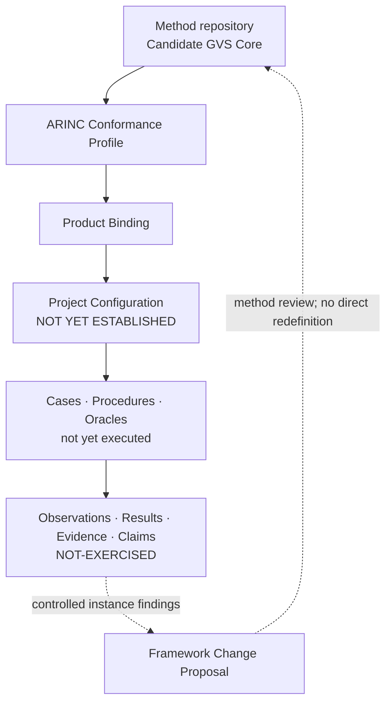

# ARINC 615A Conformance Verification

This repository owns the ARINC 615A **Profile, Product Binding, Project
Configuration, instance engineering, execution records and instance evidence**
used to apply a separately controlled generic verification methodology. It
develops an auditable Test-and-Analysis approach, with Review and Inspection
gates controlling artifacts and claims.

The root README is the sole human-readable current-status surface. Atomic
baselines, change requests, reviews and historical evidence remain immutable
records at commit-bound locations.

## Project architecture



The method repository owns the Generic Core. This repository owns the ARINC
refinement and all configuration- and execution-specific artifacts. Instance
findings may support, qualify or challenge candidate method claims, but cannot
silently redefine the Core.

<!-- project-status:start -->
## Current development picture

| Dimension | Controlled state |
|---|---|
| Repository role | ARINC 615A Profile / Binding / Configuration / instance engineering and evidence owner |
| Current release | [`RB-2026-001-v4.3.1`](docs/control/baselines/RB-2026-001-v4.3.1.md) / annotated [`v4.3.1`](https://github.com/ZhangChi0727/arinc-615a-conformance/tree/v4.3.1) |
| Method input | Candidate GVS Core 0.3 at [`48dd8232b7ef`](https://github.com/ZhangChi0727/complex-system-verification-assurance/commit/48dd8232b7efe6b0dba3fcb75dfc154d034d2b0b) |
| Protocol source | `ARINC-615A-3` / edition `615A-3` / wire version `A4` |
| Bounded source and open dependency | `ARINC-665-5`; ARINC-645 `OPEN-DEPENDENCY` |
| Technical direction | `LIGHTWEIGHT-OBSERVABLE-TIMED-EFSM` / `BOUNDED-TEST-ANALYSIS` / `NOT-A-DEPENDENCY-OR-SELECTED-PLATFORM` |
| M0 controls | [`source register`](configs/research/controlled_sources.json), [`CR-2026-006`](docs/control/changes/CR-2026-006.md), [`DD-015–DD-017`](docs/control/decisions/DESIGN_DECISIONS.md) |
| Third handshake | `COMPLETE` |
| Compatibility | `REVIEWED-COMPATIBLE-WITH-QUALIFICATION` under Q-01–Q-09 |
| Project Configuration | `NOT YET ESTABLISHED` |
| Instance evaluation | `NOT-EXERCISED` |
| RQ8 | `OPEN` |

## Current increment

**M0 — adopt ARINC 615A-3 sources and lean technical direction**

- Register ARINC 615A-3 as the sole active protocol authority, ARINC 665-5 as a bounded reference and ARINC 645 as an open dependency.
- Supersede active ARINC 615A-4 assumptions while preserving registered frozen history byte-for-byte.
- Adopt a lightweight observable timed EFSM, bounded Test-Analysis, gated open-source reuse and an injectable layered target architecture.
- Adopt the serial M0–M9 route; this increment completes only the M0 candidate.

State changes:

- The active protocol source changes from an unresolved edition assumption to controlled ARINC 615A-3.
- The current stop moves from Project Configuration to the prerequisite conformance-requirements and applicability gate.

Unchanged boundaries:

- Candidate GVS Core and compatibility-disposition identities remain separate and unchanged.
- The 18 source mapping rows, 7 instance-only rows and Q-01 through Q-09 remain unchanged.
- Project Configuration is NOT YET ESTABLISHED; instance evaluation is NOT-EXERCISED; RQ8 remains OPEN.
- Protocol conformance, certification readiness and authority acceptance remain false; no baseline or tag is created.
- M0 creates no codec, protocol operation, EFSM instance, verification case, procedure or Project Configuration.

## Current stop

`CONFORMANCE-REQUIREMENTS-SPECIFICATION-GATE` — **NOT YET ESTABLISHED**: Complete M1 ARINC 615A-3/665-5 CRS and requirement-level applicability, explicitly registering the ARINC 645 capability gap.

## Next development steps

- After M0 approval and cleanup, prepare a separate M1 work order for the 615A-3/665-5 CRS, applicability decisions and ARINC 645 gap register.
- Only after approved M1, prepare M2 refinement of the Profile, Binding and lightweight observable timed EFSM.

## 当前开发图景

| 维度 | 受控状态 |
|---|---|
| 仓库角色 | ARINC 615A Profile、Binding、Configuration、实例工程与证据的权威仓库 |
| 当前发布 | [`RB-2026-001-v4.3.1`](docs/control/baselines/RB-2026-001-v4.3.1.md) / annotated [`v4.3.1`](https://github.com/ZhangChi0727/arinc-615a-conformance/tree/v4.3.1) |
| 方法输入 | Candidate GVS Core 0.3 @ [`48dd8232b7ef`](https://github.com/ZhangChi0727/complex-system-verification-assurance/commit/48dd8232b7efe6b0dba3fcb75dfc154d034d2b0b) |
| 协议来源 | `ARINC-615A-3` / 版次 `615A-3` / 线版本 `A4` |
| 有边界来源与开放依赖 | `ARINC-665-5`；ARINC-645 `OPEN-DEPENDENCY` |
| 技术方向 | `LIGHTWEIGHT-OBSERVABLE-TIMED-EFSM` / `BOUNDED-TEST-ANALYSIS` / `NOT-A-DEPENDENCY-OR-SELECTED-PLATFORM` |
| M0 控制入口 | [`source register`](configs/research/controlled_sources.json), [`CR-2026-006`](docs/control/changes/CR-2026-006.md), [`DD-015–DD-017`](docs/control/decisions/DESIGN_DECISIONS.md) |
| 第三次握手 | `COMPLETE` |
| 兼容性 | 受 Q-01～Q-09 限定的 `REVIEWED-COMPATIBLE-WITH-QUALIFICATION` |
| Project Configuration | `NOT YET ESTABLISHED` |
| 实例评价 | `NOT-EXERCISED` |
| RQ8 | `OPEN` |

## 本次集成增量

**M0——采纳 ARINC 615A-3 来源与精简技术路线**

- 登记 ARINC 615A-3 为唯一活动协议权威、ARINC 665-5 为有边界参考、ARINC 645 为开放依赖。
- 取代活动的 ARINC 615A-4 假设，同时保持登记的冻结历史逐字节不变。
- 采纳轻量可观测 timed EFSM、有界 Test-Analysis、受门禁开源复用和可注入分层目标架构。
- 采纳 M0～M9 串行路线；本增量只完成 M0 候选。

状态变化：

- 活动协议来源从未解决的版次假设改为受控 ARINC 615A-3。
- 当前停点从 Project Configuration 前移到作为前置条件的符合性需求与适用性门。

保持不变的边界：

- Candidate GVS Core 与兼容性处置身份保持分离且不变。
- 18 个来源映射行、7 个实例专用行及 Q-01～Q-09 保持不变。
- Project Configuration 保持 NOT YET ESTABLISHED；实例评价保持 NOT-EXERCISED；RQ8 保持 OPEN。
- 协议符合性、认证准备度和权威接受保持 false；不创建 baseline 或 tag。
- M0 不创建 codec、协议操作、EFSM 实例、验证用例、规程或 Project Configuration。

## 当前停点

`CONFORMANCE-REQUIREMENTS-SPECIFICATION-GATE` — **NOT YET ESTABLISHED**：完成 M1 ARINC 615A-3/665-5 CRS 与需求级适用性，并明确登记 ARINC 645 能力缺口。

## 下一步开发计划

- M0 批准并清理后，另编 M1 工作单，处理 615A-3/665-5 CRS、适用性决定和 ARINC 645 缺口登记。
- 仅在 M1 批准后，准备 M2 Profile、Binding 和轻量可观测 timed EFSM 精化。
<!-- project-status:end -->

## Read by role / 按角色继续阅读

| Reader | Entry | Purpose |
|---|---|---|
| General reader / 普通读者 | This README and the [current release](https://github.com/ZhangChi0727/arinc-615a-conformance/tree/v4.3.1) | purpose, achieved state and unearned claims |
| Researcher / 研究人员 | [`RESEARCH_CONTROL.md`](docs/research/RESEARCH_CONTROL.md) | method inputs, ARINC refinement, experiments and claims |
| Developer / 开发者 | [`ENGINEERING_CONTROL.md`](docs/engineering/ENGINEERING_CONTROL.md) | implementation, tests, configuration and evidence production |
| Agent | [`project-status.json`](project-status.json) | machine state, stop point, next steps and prohibited actions |
| Tutorial reader / 教程读者 | [`TUTORIAL_CONTROL.md`](docs/tutorial/TUTORIAL_CONTROL.md) | common and ARINC-specific tutorial products |
| Maintainer / 维护者 | [`PROJECT_CONTROL.md`](docs/control/PROJECT_CONTROL.md), [`CHANGE_CONTROL.md`](docs/control/CHANGE_CONTROL.md) | workflow, gates, PR and release discipline |

## Repository structure

```text
README.md                 sole human-readable current-status surface
project-status.json       machine-readable lifecycle and cross-repository state
pyproject.toml             Python package/build/test metadata
.github/                  CI and repository configuration
src/                       verification instrument source
tests/                     executable engineering and governance checks
configs/                   controlled machine-readable inputs and templates
scripts/                   synchronization and validation automation
docs/                      developer control plane and atomic records
artifacts/reports/current/ legacy report path retained for immutable references; not current status
artifacts/reports/archive/ other historical reader reports
artifacts/tutorials/       published tutorial outputs
artifacts/releases/        distributable release packages
artifacts/evidence/        generated evidence packages, normally untracked
local-references/          ignored local research inputs, never published
```

`pyproject.toml` remains at the root because packaging, editable installation,
test discovery and development tools locate it there by convention. It is
machine-facing executable configuration, not a reader report.

## Quick start

```bash
python -m pip install -e ".[dev]"
python scripts/sync_project_overview.py --check
python scripts/check_repo_baseline.py
python -m pytest tests/ -q
```

Do not commit proprietary ARINC or employer-only ICD text. A passing test suite
is engineering evidence, not by itself a conformance proof, certification
finding or scientific result.

不得提交专有 ARINC 或雇主内部 ICD 原文。测试通过属于工程证据，本身不是符合性证明、
认证结论或科学研究结果。
