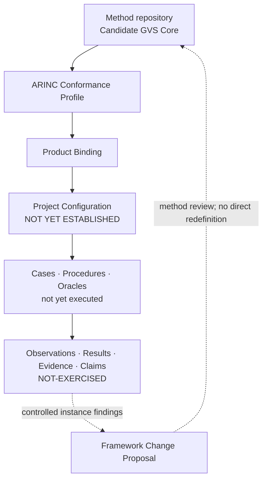

# ARINC 615A Conformance Verification

This repository owns the ARINC 615A **Profile, Product Binding, Project
Configuration, instance engineering, execution records and instance evidence**
used to apply a separately controlled generic verification methodology. It
develops an auditable Test-and-Analysis approach, with Review and Inspection
gates controlling artifacts and claims.

The root README is the sole human-readable current-status surface. Atomic
baselines, change requests, reviews and historical evidence remain immutable
records at commit-bound locations.

## Project architecture



The method repository owns the Generic Core. This repository owns the ARINC
refinement and all configuration- and execution-specific artifacts. Instance
findings may support, qualify or challenge candidate method claims, but cannot
silently redefine the Core.

<!-- project-status:start -->
## Current development picture

| Dimension | Controlled state |
|---|---|
| Repository role | ARINC 615A Profile / Binding / Configuration / instance engineering and evidence owner |
| Current release | [`RB-2026-001-v4.3.1`](docs/control/baselines/RB-2026-001-v4.3.1.md) / annotated [`v4.3.1`](https://github.com/ZhangChi0727/arinc-615a-conformance/tree/v4.3.1) |
| Method input | Candidate GVS Core 0.3 at [`48dd8232b7ef`](https://github.com/ZhangChi0727/complex-system-verification-assurance/commit/48dd8232b7efe6b0dba3fcb75dfc154d034d2b0b) |
| Protocol source | `ARINC-615A-3` / edition `615A-3` / wire version `A4` |
| Bounded source and open dependency | `ARINC-665-5`, `ARINC-664-2`, `ARINC-664-3` (BOUNDED-ACTIVE); `ARINC-664-7` (CONDITIONAL-DEPLOYMENT); ARINC-645 `OPEN-DEPENDENCY`, ARINC-664-3 `OPEN-DEPENDENCY`, ARINC-664-7 `OPEN-DEPENDENCY`, RFC-768 `OPEN-DEPENDENCY`, RFC-791 `OPEN-DEPENDENCY`, RFC-1123 `OPEN-DEPENDENCY`, RFC-1350 `OPEN-DEPENDENCY`, RFC-1785 `OPEN-DEPENDENCY`, RFC-2347 `OPEN-DEPENDENCY`, RFC-2348 `OPEN-DEPENDENCY`, RFC-2349 `OPEN-DEPENDENCY`, RFC-1122 `OPEN-DEPENDENCY` |
| Technical direction | `LIGHTWEIGHT-OBSERVABLE-TIMED-EFSM` / `BOUNDED-TEST-ANALYSIS` / platform `deferred: TTCN-3` |
| Delivery position | current `M2` / next `M3` / disposition `ADOPT` |
| Activation boundary | merge evidence `EXTERNAL-VERIFICATION-REQUIRED` / approval `NOT-AUTOMATED` |
| Technical controls | [`source register`](configs/research/controlled_sources.json), [`activation control`](docs/control/changes/CR-2026-008.md), [`technical decisions`](docs/control/decisions/DESIGN_DECISIONS.md), [`M1 package`](configs/requirements/arinc_615a3_m1_crs.json), [`generated M1 review view`](docs/control/requirements/ARINC615A3_M1_CRS_REVIEW_VIEW.md), [`M2 package`](configs/models/arinc_615a3_m2_model.json), [`generated M2 review view`](docs/control/models/ARINC615A3_M2_MODEL_REVIEW_VIEW.md) |
| Third handshake | `COMPLETE` |
| Compatibility | `REVIEWED-COMPATIBLE-WITH-QUALIFICATION` under Q-01–Q-09 |
| Project Configuration | `NOT YET ESTABLISHED` |
| Instance evaluation | `NOT-EXERCISED` |
| RQ8 | `OPEN` |

## Current increment

**M2 observable timed model and bounded source refinement candidate**

- Record owner-accepted M1 sign-off and merge facts in M2 inputAcceptance without rewriting merged M1 bytes.
- Deliver an observable timed EFSM for UPLOAD and INFORMATION with an explicit LUR list stage, obligation-level traces, clock-enabled timeouts and the Attachment 4 retry equation.
- Add source-explicit 615A→665 and TFTP-option refinements used by the model; keep AFDX, FIND, 645 and P3 deviations deferred.
- Plan IPv4/UDP substantiation for Project Configuration; do not establish network or integrity capabilities.

State changes:

- M0 and M1 are COMPLETED-EXTERNALLY-VERIFIED. M2 is a DISPOSITION-ADOPT candidate under CR-2026-008.
- currentStop is EXECUTABLE-FOUNDATION-GATE, which blocks M3 until M2 is independently approved, ordinarily merged and main CI succeeds.

Unchanged boundaries:

- Candidate GVS Core and compatibility-disposition identities remain separate and unchanged.
- The 18 source mapping rows, 7 instance-only rows and Q-01 through Q-09 remain unchanged.
- Project Configuration is NOT YET ESTABLISHED; instance evaluation is NOT-EXERCISED; RQ8 remains OPEN.
- Protocol conformance, certification readiness and authority acceptance remain false; no baseline or tag is created.
- This M2 candidate creates no codec, executable EFSM engine, verification case, procedure, execution evidence or Project Configuration.

## Current stop

`EXECUTABLE-FOUNDATION-GATE` — **NOT YET ESTABLISHED**: This stop blocks M3 until joint RG0/RG1/RG2 approval binds the exact reviewed M2 Head, an ordinary merge has that Head as second parent, and main CI succeeds.

## Next development steps

- Obtain independent RG0, incremental RG1 and RG2 review of the complete M2 range on the unchanged final Head.
- Do not merge, tag or start M3 until that review, user authorization, ordinary two-parent merge and main CI succeed.

## 当前开发图景

| 维度 | 受控状态 |
|---|---|
| 仓库角色 | ARINC 615A Profile、Binding、Configuration、实例工程与证据的权威仓库 |
| 当前发布 | [`RB-2026-001-v4.3.1`](docs/control/baselines/RB-2026-001-v4.3.1.md) / annotated [`v4.3.1`](https://github.com/ZhangChi0727/arinc-615a-conformance/tree/v4.3.1) |
| 方法输入 | Candidate GVS Core 0.3 @ [`48dd8232b7ef`](https://github.com/ZhangChi0727/complex-system-verification-assurance/commit/48dd8232b7efe6b0dba3fcb75dfc154d034d2b0b) |
| 协议来源 | `ARINC-615A-3` / 版次 `615A-3` / 线版本 `A4` |
| 有边界来源与开放依赖 | `ARINC-665-5`, `ARINC-664-2`, `ARINC-664-3` (BOUNDED-ACTIVE); `ARINC-664-7` (CONDITIONAL-DEPLOYMENT)；ARINC-645 `OPEN-DEPENDENCY`, ARINC-664-3 `OPEN-DEPENDENCY`, ARINC-664-7 `OPEN-DEPENDENCY`, RFC-768 `OPEN-DEPENDENCY`, RFC-791 `OPEN-DEPENDENCY`, RFC-1123 `OPEN-DEPENDENCY`, RFC-1350 `OPEN-DEPENDENCY`, RFC-1785 `OPEN-DEPENDENCY`, RFC-2347 `OPEN-DEPENDENCY`, RFC-2348 `OPEN-DEPENDENCY`, RFC-2349 `OPEN-DEPENDENCY`, RFC-1122 `OPEN-DEPENDENCY` |
| 技术方向 | `LIGHTWEIGHT-OBSERVABLE-TIMED-EFSM` / `BOUNDED-TEST-ANALYSIS` / 平台 `deferred: TTCN-3` |
| 交付位置 | 当前 `M2` / 下一 `M3` / 处置 `ADOPT` |
| 激活边界 | 合并证据 `EXTERNAL-VERIFICATION-REQUIRED` / 批准 `NOT-AUTOMATED` |
| 技术控制入口 | [`source register`](configs/research/controlled_sources.json), [`activation control`](docs/control/changes/CR-2026-008.md), [`technical decisions`](docs/control/decisions/DESIGN_DECISIONS.md), [`M1 package`](configs/requirements/arinc_615a3_m1_crs.json), [`generated M1 review view`](docs/control/requirements/ARINC615A3_M1_CRS_REVIEW_VIEW.md), [`M2 package`](configs/models/arinc_615a3_m2_model.json), [`generated M2 review view`](docs/control/models/ARINC615A3_M2_MODEL_REVIEW_VIEW.md) |
| 第三次握手 | `COMPLETE` |
| 兼容性 | 受 Q-01～Q-09 限定的 `REVIEWED-COMPATIBLE-WITH-QUALIFICATION` |
| Project Configuration | `NOT YET ESTABLISHED` |
| 实例评价 | `NOT-EXERCISED` |
| RQ8 | `OPEN` |

## 本次集成增量

**M2 可观测时序模型与有边界来源精化候选**

- 在 M2 inputAcceptance 中记录所有者接受的 M1 签署与合并事实，不改写已合并 M1 字节。
- 交付 UPLOAD 与 INFORMATION 的可观测 timed EFSM，含明确的 LUR 列表阶段、义务级追踪、时钟使能超时和附件 4 重试方程。
- 为模型实际使用的对象增加 615A→665 与 TFTP 选项精化；FIND、AFDX、645 与 P3 偏差保持延期。
- 规划 IPv4/UDP 基础设施验证以备 Project Configuration；不建立网络或完整性能力。

状态变化：

- M0 与 M1 为 COMPLETED-EXTERNALLY-VERIFIED。M2 在 CR-2026-008 下为 DISPOSITION-ADOPT 候选。
- currentStop 为 EXECUTABLE-FOUNDATION-GATE，在 M2 获独立批准、普通合并且 main CI 成功前阻止 M3。

保持不变的边界：

- Candidate GVS Core 与兼容性处置身份保持分离且不变。
- 18 个来源映射行、7 个实例专用行及 Q-01～Q-09 保持不变。
- Project Configuration 保持 NOT YET ESTABLISHED；实例评价保持 NOT-EXERCISED；RQ8 保持 OPEN。
- 协议符合性、认证准备度和权威接受保持 false；不创建 baseline 或 tag。
- 本 M2 候选不创建 codec、可执行 EFSM 引擎、验证用例、规程、执行证据或 Project Configuration。

## 当前停点

`EXECUTABLE-FOUNDATION-GATE` — **NOT YET ESTABLISHED**：本停点禁止 M3，直至 RG0/RG1/RG2 联合批准绑定精确受审 M2 Head、普通合并的第二父为该 Head，且 main CI 成功。

## 下一步开发计划

- 在不再变化的最终 Head 上，对完整 M2 范围取得独立 RG0、增量 RG1 与 RG2 评审。
- 在该评审、用户授权、普通两父合并且 main CI 成功前，不合并、不打标签、不启动 M3。
<!-- project-status:end -->

## Read by role / 按角色继续阅读

| Reader | Entry | Purpose |
|---|---|---|
| General reader / 普通读者 | This README and the [current release](https://github.com/ZhangChi0727/arinc-615a-conformance/tree/v4.3.1) | purpose, achieved state and unearned claims |
| Researcher / 研究人员 | [`RESEARCH_CONTROL.md`](docs/research/RESEARCH_CONTROL.md) | method inputs, ARINC refinement, experiments and claims |
| Developer / 开发者 | [`ENGINEERING_CONTROL.md`](docs/engineering/ENGINEERING_CONTROL.md) | implementation, tests, configuration and evidence production |
| Agent | [`project-status.json`](project-status.json) | machine state, stop point, next steps and prohibited actions |
| Tutorial reader / 教程读者 | [`TUTORIAL_CONTROL.md`](docs/tutorial/TUTORIAL_CONTROL.md) | common and ARINC-specific tutorial products |
| Maintainer / 维护者 | [`PROJECT_CONTROL.md`](docs/control/PROJECT_CONTROL.md), [`CHANGE_CONTROL.md`](docs/control/CHANGE_CONTROL.md) | workflow, gates, PR and release discipline |

## Repository structure

```text
README.md                 sole human-readable current-status surface
project-status.json       machine-readable lifecycle and cross-repository state
pyproject.toml             Python package/build/test metadata
.github/                  CI and repository configuration
src/                       verification instrument source
tests/                     executable engineering and governance checks
configs/                   controlled machine-readable inputs and templates
scripts/                   synchronization and validation automation
docs/                      developer control plane and atomic records
artifacts/reports/current/ legacy report path retained for immutable references; not current status
artifacts/reports/archive/ other historical reader reports
artifacts/tutorials/       published tutorial outputs
artifacts/releases/        distributable release packages
artifacts/evidence/        generated evidence packages, normally untracked
local-references/          ignored local research inputs, never published
```

`pyproject.toml` remains at the root because packaging, editable installation,
test discovery and development tools locate it there by convention. It is
machine-facing executable configuration, not a reader report.

## Quick start

```bash
python -m pip install -e ".[dev]"
python scripts/sync_project_overview.py --check
python scripts/check_repo_baseline.py
python -m pytest tests/ -q
```

Do not commit proprietary ARINC or employer-only ICD text. A passing test suite
is engineering evidence, not by itself a conformance proof, certification
finding or scientific result.

不得提交专有 ARINC 或雇主内部 ICD 原文。测试通过属于工程证据，本身不是符合性证明、
认证结论或科学研究结果。
