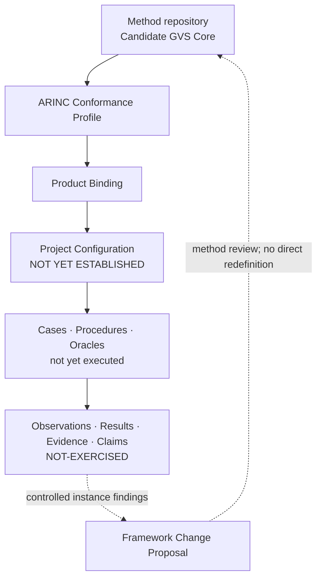

# ARINC 615A Conformance Verification

This repository owns the ARINC 615A **Profile, Product Binding, Project
Configuration, instance engineering, execution records and instance evidence**
used to apply a separately controlled generic verification methodology. It
develops an auditable Test-and-Analysis approach, with Review and Inspection
gates controlling artifacts and claims.

The root README is the sole human-readable current-status surface. Atomic
baselines, change requests, reviews and historical evidence remain immutable
records at commit-bound locations.

## Project architecture



The method repository owns the Generic Core. This repository owns the ARINC
refinement and all configuration- and execution-specific artifacts. Instance
findings may support, qualify or challenge candidate method claims, but cannot
silently redefine the Core.

<!-- project-status:start -->
## Current development picture

| Dimension | Controlled state |
|---|---|
| Repository role | ARINC 615A Profile / Binding / Configuration / instance engineering and evidence owner |
| Current release | [`RB-2026-001-v4.3.1`](docs/control/baselines/RB-2026-001-v4.3.1.md) / annotated [`v4.3.1`](https://github.com/ZhangChi0727/arinc-615a-conformance/tree/v4.3.1) |
| Method input | Candidate GVS Core 0.3 at [`48dd8232b7ef`](https://github.com/ZhangChi0727/complex-system-verification-assurance/commit/48dd8232b7efe6b0dba3fcb75dfc154d034d2b0b) |
| Protocol source | `ARINC-615A-3` / edition `615A-3` / wire version `A4` |
| Bounded source and open dependency | `ARINC-665-5`, `ARINC-664-2`, `ARINC-664-3` (BOUNDED-ACTIVE); `ARINC-664-7` (CONDITIONAL-DEPLOYMENT); ARINC-645 `OPEN-DEPENDENCY`, ARINC-664-3 `OPEN-DEPENDENCY`, ARINC-664-7 `OPEN-DEPENDENCY`, RFC-768 `OPEN-DEPENDENCY`, RFC-791 `OPEN-DEPENDENCY`, RFC-1123 `OPEN-DEPENDENCY`, RFC-1350 `OPEN-DEPENDENCY`, RFC-1785 `OPEN-DEPENDENCY`, RFC-2347 `OPEN-DEPENDENCY`, RFC-2348 `OPEN-DEPENDENCY`, RFC-2349 `OPEN-DEPENDENCY`, RFC-1122 `OPEN-DEPENDENCY` |
| Technical direction | `LIGHTWEIGHT-OBSERVABLE-TIMED-EFSM` / `CL-TAV` / platform `deferred: TTCN-3` |
| Delivery position | current `M2` / next `M3` / disposition `ADOPT` |
| Activation boundary | merge evidence `EXTERNAL-VERIFICATION-REQUIRED` / approval `NOT-AUTOMATED` |
| Technical controls | [`source register`](configs/research/controlled_sources.json), [`activation control`](docs/control/changes/CR-2026-012.md), [`technical decisions`](docs/control/decisions/DESIGN_DECISIONS.md), [`M1 package`](configs/requirements/arinc_615a3_m1_crs.json), [`generated M1 review view`](docs/control/requirements/ARINC615A3_M1_CRS_REVIEW_VIEW.md), [`M2 package`](configs/models/arinc_615a3_m2_model.json), [`generated M2 review view`](docs/control/models/ARINC615A3_M2_MODEL_REVIEW_VIEW.md) |
| Third handshake | `COMPLETE` |
| Compatibility | `REVIEWED-COMPATIBLE-WITH-QUALIFICATION` under Q-01–Q-09 |
| Project Configuration | `NOT YET ESTABLISHED` |
| Instance evaluation | `NOT-EXERCISED` |
| RQ8 | `OPEN` |

## Current increment

**CL-TAV method, paper plan and expanded protocol CRS candidate**

- Record the bounded M2 ordinary merge as a preserved fact. That exit covers UPLOAD/INFORMATION only. This increment does not transplant that approval onto new CRS services and does not start M3.
- Adopt CL-TAV as the successor research method (CR-2026-012 / DD-028). First-version algorithm direction was accepted 2026-09-14 in DD-029; that is not independent mathematical or RG approval.
- Expand protocol CRS so INFORMATION, UPLOAD, Media Defined DOWNLOAD, Operator Defined DOWNLOAD, FIND and source-stated abort/reject/exception/retry obligations are audited. Conditional network variants stay separate from the current Compliant instance. ARINC 645 unique algorithm details remain BLOCKED-SOURCE-645: locally acquired, not bound in this PR.
- Keep protocol CRS semantically complete in this PR, but write new rows only after source-unit audit. Tool requirements, verification specifications, interface/configuration contracts and development-ready acceptance belong to a later PR after this CRS is independently accepted. Old M2 does not automatically cover the new scope.
- Bind remaining RFC 1123 §4.2 host notes, 664-7 VL/BAG/jitter encoding and RFC 791 header-field widths on the unique Draft PR. Current inventory is M1-CANDIDATE-12 with 2970 coverage / 680 requirements. 664-4 / CRS-M1-00519 stays unbound. The two 664-7 max_jitter formulas and MAC source construction remain unfinished inside chapter 3. instanceBoundOperations stay UPLOAD/INFORMATION; researchExpandedOperations are DOWNLOAD/FIND. Bound M2 still does not execute FIND, DOWNLOAD or AFDX (65 transitions, 26 observational timing rows). ARINC 645 is locally acquired and not bound. This Draft candidate is not independent architecture, mathematical or RG approval.

State changes:

- Bounded M2 merge of PR #14 is recorded. M3 remains blocked. CR-2026-012 is the successor method/paper/expanded-protocol-CRS increment.
- currentStop remains EXECUTABLE-FOUNDATION-GATE for M3 implementation. DD-029 first-version design direction was accepted 2026-09-14 and is not independent mathematical or RG approval.

Unchanged boundaries:

- Candidate GVS Core and compatibility-disposition identities remain separate and unchanged.
- The 18 source mapping rows, 7 instance-only rows and Q-01 through Q-09 remain unchanged.
- Project Configuration is NOT YET ESTABLISHED; instance evaluation is NOT-EXERCISED; RQ8 remains OPEN.
- Protocol conformance, certification readiness and authority acceptance remain false; no baseline or tag is created.
- This increment creates no codec, executable EFSM engine, verification case, procedure, execution evidence or Project Configuration.

## Current stop

`EXECUTABLE-FOUNDATION-GATE` — **NOT YET ESTABLISHED**: This stop still blocks M3 implementation. PR #14 recorded a bounded M2 ordinary merge; that approval is not transplanted onto expanded CRS. The CL-TAV Draft candidate is M1-CANDIDATE-12 with FIND abort non-waiver, bound RFC 1123/791 and 664-7 VL/BAG/jitter leaves, and combined TFTP end conditions; it is not method/paper/expanded-CRS approval. Independent review must pass, and merge requires explicit authorization. Do not Ready, merge or tag on this increment. The 2026-09-14 DD-029 design-direction acceptance is not independent approval.

## Next development steps

- Request complete-range RG0/RG1 and method/math/architecture/experiment review on the unique Draft PR. Keep independentMathematicalApproval and independentReviewApproval false. Do not Ready, merge, tag or start M3.
- Keep 665 section 2.3 emitted-not-closed. ARINC 645 stays acquired-not-bound. Bound M2 stays UPLOAD/INFORMATION. FIND clock limited approval stays closed. 664-4 / CRS-M1-00519 stays unbound. The 664-7 max_jitter formulas and MAC source construction stay unfinished in this PR and are not transferred to a successor PR.

## 当前开发图景

| 维度 | 受控状态 |
|---|---|
| 仓库角色 | ARINC 615A Profile、Binding、Configuration、实例工程与证据的权威仓库 |
| 当前发布 | [`RB-2026-001-v4.3.1`](docs/control/baselines/RB-2026-001-v4.3.1.md) / annotated [`v4.3.1`](https://github.com/ZhangChi0727/arinc-615a-conformance/tree/v4.3.1) |
| 方法输入 | Candidate GVS Core 0.3 @ [`48dd8232b7ef`](https://github.com/ZhangChi0727/complex-system-verification-assurance/commit/48dd8232b7efe6b0dba3fcb75dfc154d034d2b0b) |
| 协议来源 | `ARINC-615A-3` / 版次 `615A-3` / 线版本 `A4` |
| 有边界来源与开放依赖 | `ARINC-665-5`, `ARINC-664-2`, `ARINC-664-3` (BOUNDED-ACTIVE); `ARINC-664-7` (CONDITIONAL-DEPLOYMENT)；ARINC-645 `OPEN-DEPENDENCY`, ARINC-664-3 `OPEN-DEPENDENCY`, ARINC-664-7 `OPEN-DEPENDENCY`, RFC-768 `OPEN-DEPENDENCY`, RFC-791 `OPEN-DEPENDENCY`, RFC-1123 `OPEN-DEPENDENCY`, RFC-1350 `OPEN-DEPENDENCY`, RFC-1785 `OPEN-DEPENDENCY`, RFC-2347 `OPEN-DEPENDENCY`, RFC-2348 `OPEN-DEPENDENCY`, RFC-2349 `OPEN-DEPENDENCY`, RFC-1122 `OPEN-DEPENDENCY` |
| 技术方向 | `LIGHTWEIGHT-OBSERVABLE-TIMED-EFSM` / `CL-TAV` / 平台 `deferred: TTCN-3` |
| 交付位置 | 当前 `M2` / 下一 `M3` / 处置 `ADOPT` |
| 激活边界 | 合并证据 `EXTERNAL-VERIFICATION-REQUIRED` / 批准 `NOT-AUTOMATED` |
| 技术控制入口 | [`source register`](configs/research/controlled_sources.json), [`activation control`](docs/control/changes/CR-2026-012.md), [`technical decisions`](docs/control/decisions/DESIGN_DECISIONS.md), [`M1 package`](configs/requirements/arinc_615a3_m1_crs.json), [`generated M1 review view`](docs/control/requirements/ARINC615A3_M1_CRS_REVIEW_VIEW.md), [`M2 package`](configs/models/arinc_615a3_m2_model.json), [`generated M2 review view`](docs/control/models/ARINC615A3_M2_MODEL_REVIEW_VIEW.md) |
| 第三次握手 | `COMPLETE` |
| 兼容性 | 受 Q-01～Q-09 限定的 `REVIEWED-COMPATIBLE-WITH-QUALIFICATION` |
| Project Configuration | `NOT YET ESTABLISHED` |
| 实例评价 | `NOT-EXERCISED` |
| RQ8 | `OPEN` |

## 本次集成增量

**CL-TAV 方法、论文计划与扩大协议 CRS 候选**

- 将有界 M2 普通合并作为保留事实记录。该出口只覆盖 UPLOAD／INFORMATION。本增量不把该批准移植到新 CRS 服务，也不启动 M3。
- 以 CL-TAV 为后继研究方法（CR-2026-012／DD-028）。首版算法方向已于 2026-09-14 在 DD-029 接受；那不是独立数学或 RG 批准。
- 扩大协议 CRS，使 INFORMATION、UPLOAD、Media Defined DOWNLOAD、Operator Defined DOWNLOAD、FIND 及来源已规定的中断／拒绝／异常／重试义务接受审计。条件化网络变体与当前 Compliant 实例分开。ARINC 645 独有算法细节保持 BLOCKED-SOURCE-645：本地已取得，本 PR 不绑定。
- 本 PR 的协议 CRS 必须语义正确且范围完整，但新行只能在来源单元审计之后撰写。工具需求、验证规格、接口／配置契约和开发就绪验收属于扩大 CRS 被独立接受之后的后继 PR。旧 M2 不会自动覆盖新范围。
- 已在唯一 Draft PR 绑定 RFC 1123 §4.2 主机说明、664-7 VL／BAG／抖动编码与 RFC 791 头字段宽度。当前清单为 M1-CANDIDATE-12，2970 条 coverage／680 条需求。664-4／CRS-M1-00519 仍未绑定。第 3 章两个 max_jitter 公式与 MAC 源地址构造仍未完成。instanceBoundOperations 仍为 UPLOAD／INFORMATION；researchExpandedOperations 为 DOWNLOAD／FIND。绑定 M2 仍不执行 FIND、DOWNLOAD 或 AFDX（65 个迁移，26 条观察时序）。ARINC 645 本地已取得但未绑定。本 Draft 候选不是独立架构、数学或 RG 批准。

状态变化：

- PR #14 的有界 M2 合并已记录。M3 保持阻塞。CR-2026-012 为后继方法／论文／扩大协议 CRS 增量。
- 对 M3 实现而言 currentStop 仍为 EXECUTABLE-FOUNDATION-GATE。DD-029 首版设计方向已于 2026-09-14 接受，不是独立数学或 RG 批准。

保持不变的边界：

- Candidate GVS Core 与兼容性处置身份保持分离且不变。
- 18 个来源映射行、7 个实例专用行及 Q-01～Q-09 保持不变。
- Project Configuration 保持 NOT YET ESTABLISHED；实例评价保持 NOT-EXERCISED；RQ8 保持 OPEN。
- 协议符合性、认证准备度和权威接受保持 false；不创建 baseline 或 tag。
- 本增量不创建 codec、可执行 EFSM 引擎、验证用例、规程、执行证据或 Project Configuration。

## 当前停点

`EXECUTABLE-FOUNDATION-GATE` — **NOT YET ESTABLISHED**：本停点仍禁止 M3 实现。PR #14 记录了有界 M2 普通合并；该批准不移植到扩大 CRS。CL-TAV Draft 候选为 M1-CANDIDATE-12，含 FIND 中止不豁免、已绑定的 RFC 1123／791 与 664-7 VL／BAG／抖动叶及组合后的 TFTP 结束条件，不是方法／论文／扩大 CRS 批准。须通过独立评审，合并须明确授权。本增量不转 Ready、不合并、不打标签。2026-09-14 对 DD-029 的设计方向接受不是独立批准。

## 下一步开发计划

- 在唯一 Draft PR 上请求完整范围 RG0／RG1 以及方法／数学／架构／实验评审。保持 independentMathematicalApproval 与 independentReviewApproval 为 false。不转 Ready、不合并、不打标签、不启动 M3。
- 665 §2.3 保持已发出未闭合。ARINC 645 保持已取得未绑定。绑定 M2 仍为 UPLOAD／INFORMATION。FIND 时钟有限批准保持关闭。664-4／CRS-M1-00519 仍未绑定。664-7 max_jitter 公式与 MAC 源地址构造仍在本 PR 未完成，不移交后继 PR。
<!-- project-status:end -->

## Read by role / 按角色继续阅读

| Reader | Entry | Purpose |
|---|---|---|
| General reader / 普通读者 | This README and the [current release](https://github.com/ZhangChi0727/arinc-615a-conformance/tree/v4.3.1) | purpose, achieved state and unearned claims |
| Researcher / 研究人员 | [`RESEARCH_CONTROL.md`](docs/research/RESEARCH_CONTROL.md) | method inputs, ARINC refinement, experiments and claims |
| Developer / 开发者 | [`ENGINEERING_CONTROL.md`](docs/engineering/ENGINEERING_CONTROL.md) | implementation, tests, configuration and evidence production |
| Agent | [`project-status.json`](project-status.json) | machine state, stop point, next steps and prohibited actions |
| Tutorial reader / 教程读者 | [`TUTORIAL_CONTROL.md`](docs/tutorial/TUTORIAL_CONTROL.md) | common and ARINC-specific tutorial products |
| Maintainer / 维护者 | [`PROJECT_CONTROL.md`](docs/control/PROJECT_CONTROL.md), [`CHANGE_CONTROL.md`](docs/control/CHANGE_CONTROL.md) | workflow, gates, PR and release discipline |

## Repository structure

```text
README.md                 sole human-readable current-status surface
project-status.json       machine-readable lifecycle and cross-repository state
pyproject.toml             Python package/build/test metadata
.github/                  CI and repository configuration
src/                       verification instrument source
tests/                     executable engineering and governance checks
configs/                   controlled machine-readable inputs and templates
scripts/                   synchronization and validation automation
docs/                      developer control plane and atomic records
artifacts/reports/current/ legacy report path retained for immutable references; not current status
artifacts/reports/archive/ other historical reader reports
artifacts/tutorials/       published tutorial outputs
artifacts/releases/        distributable release packages
artifacts/evidence/        generated evidence packages, normally untracked
local-references/          ignored local research inputs, never published
```

`pyproject.toml` remains at the root because packaging, editable installation,
test discovery and development tools locate it there by convention. It is
machine-facing executable configuration, not a reader report.

## Quick start

```bash
python -m pip install -e ".[dev]"
python scripts/sync_project_overview.py --check
python scripts/check_repo_baseline.py
python -m pytest tests/ -q
```

Do not commit proprietary ARINC or employer-only ICD text. A passing test suite
is engineering evidence, not by itself a conformance proof, certification
finding or scientific result.

不得提交专有 ARINC 或雇主内部 ICD 原文。测试通过属于工程证据，本身不是符合性证明、
认证结论或科学研究结果。
