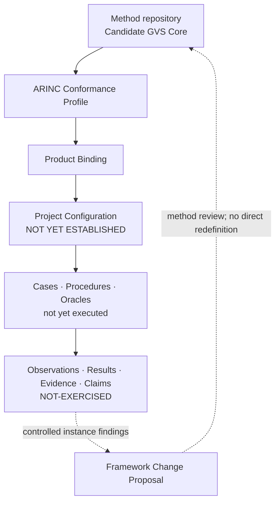

# ARINC 615A Conformance Verification

This repository owns the ARINC 615A **Profile, Product Binding, Project
Configuration, instance engineering, execution records and instance evidence**
used to apply a separately controlled generic verification methodology. It
develops an auditable Test-and-Analysis approach, with Review and Inspection
gates controlling artifacts and claims.

The root README is the sole human-readable current-status surface. Atomic
baselines, change requests, reviews and historical evidence remain immutable
records at commit-bound locations.

## Project architecture



The method repository owns the Generic Core. This repository owns the ARINC
refinement and all configuration- and execution-specific artifacts. Instance
findings may support, qualify or challenge candidate method claims, but cannot
silently redefine the Core.

<!-- project-status:start -->
## Current development picture

| Dimension | Controlled state |
|---|---|
| Repository role | ARINC 615A Profile / Binding / Configuration / instance engineering and evidence owner |
| Current release | [`RB-2026-001-v4.3.1`](docs/control/baselines/RB-2026-001-v4.3.1.md) / annotated [`v4.3.1`](https://github.com/ZhangChi0727/arinc-615a-conformance/tree/v4.3.1) |
| Method input | Candidate GVS Core 0.3 at [`48dd8232b7ef`](https://github.com/ZhangChi0727/complex-system-verification-assurance/commit/48dd8232b7efe6b0dba3fcb75dfc154d034d2b0b) |
| Third handshake | `COMPLETE` |
| Compatibility | `REVIEWED-COMPATIBLE-WITH-QUALIFICATION` under Q-01–Q-09 |
| Project Configuration | `NOT YET ESTABLISHED` |
| Instance evaluation | `NOT-EXERCISED` |
| RQ8 | `OPEN` |

## Current increment

**Lean project-management control surface**

- Make the root README the sole human-readable current-status surface.
- Add a machine-readable project status and deterministic README synchronization.
- Define the Candidate GVS Core to ARINC refinement and controlled-feedback architecture.
- Retire duplicated reader-status and HANDOFF surfaces without rewriting atomic records.
- Close independent-review gaps in dynamic script discovery, status activation and active-template governance.

State changes:

- Current-status ownership moves to README plus project-status.json.
- The v4.2.1 reader report is retained at its legacy path as historical evidence and no longer owns current status.

Unchanged boundaries:

- Candidate GVS Core and compatibility-disposition identities remain separate and unchanged.
- The 18 source mapping rows, 7 instance-only rows and Q-01 through Q-09 remain unchanged.
- Project Configuration is NOT YET ESTABLISHED; instance evaluation is NOT-EXERCISED; RQ8 remains OPEN.
- No baseline, tag, certification, authority acceptance or protocol-conformance claim is created.

## Current stop

`PROJECT-CONFIGURATION-GATE` — **NOT YET ESTABLISHED**: Establish real, reviewed IUT, environment, tool, procedure, clock and error-budget identities before execution.

## Next development steps

- Populate and review a real Project Configuration from controlled values.
- Bind the first verification cases, procedures and oracles to that configuration.
- Execute the first controlled instance evaluation and preserve observations, results and evidence provenance.
- Return method findings through a Framework Change Proposal without directly redefining the Generic Core.

## 当前开发图景

| 维度 | 受控状态 |
|---|---|
| 仓库角色 | ARINC 615A Profile、Binding、Configuration、实例工程与证据的权威仓库 |
| 当前发布 | [`RB-2026-001-v4.3.1`](docs/control/baselines/RB-2026-001-v4.3.1.md) / annotated [`v4.3.1`](https://github.com/ZhangChi0727/arinc-615a-conformance/tree/v4.3.1) |
| 方法输入 | Candidate GVS Core 0.3 @ [`48dd8232b7ef`](https://github.com/ZhangChi0727/complex-system-verification-assurance/commit/48dd8232b7efe6b0dba3fcb75dfc154d034d2b0b) |
| 第三次握手 | `COMPLETE` |
| 兼容性 | 受 Q-01～Q-09 限定的 `REVIEWED-COMPATIBLE-WITH-QUALIFICATION` |
| Project Configuration | `NOT YET ESTABLISHED` |
| 实例评价 | `NOT-EXERCISED` |
| RQ8 | `OPEN` |

## 本次集成增量

**精简项目管理控制面**

- 将根 README 确立为唯一的人类可读当前状态界面。
- 新增机器可读项目状态和确定性 README 同步。
- 明确 Candidate GVS Core 到 ARINC 精化及受控反馈的架构。
- 在不改写原子记录的前提下退役重复 reader-status 与 HANDOFF 界面。
- 关闭独立评审发现的动态脚本发现、状态激活和活动模板治理缺口。

状态变化：

- 当前状态由 README 与 project-status.json 共同承载。
- v4.2.1 reader report 在原路径保留为历史证据，不再拥有当前状态。

保持不变的边界：

- Candidate GVS Core 与兼容性处置身份保持分离且不变。
- 18 个来源映射行、7 个实例专用行及 Q-01～Q-09 保持不变。
- Project Configuration 保持 NOT YET ESTABLISHED；实例评价保持 NOT-EXERCISED；RQ8 保持 OPEN。
- 不创建 baseline、tag、认证、权威接受或协议符合性主张。

## 当前停点

`PROJECT-CONFIGURATION-GATE` — **NOT YET ESTABLISHED**：执行前建立并评审真实的 IUT、环境、工具、规程、时钟和误差预算身份。

## 下一步开发计划

- 用受控真实值建立并评审 Project Configuration。
- 将首批 verification case、procedure 与 oracle 绑定至该配置。
- 执行首次受控实例评价并保存 Observation、Result 和 Evidence 来源。
- 通过 Framework Change Proposal 向方法仓库反馈，不直接反向定义 Generic Core。
<!-- project-status:end -->

## Read by role / 按角色继续阅读

| Reader | Entry | Purpose |
|---|---|---|
| General reader / 普通读者 | This README and the [current release](https://github.com/ZhangChi0727/arinc-615a-conformance/tree/v4.3.1) | purpose, achieved state and unearned claims |
| Researcher / 研究人员 | [`RESEARCH_CONTROL.md`](docs/research/RESEARCH_CONTROL.md) | method inputs, ARINC refinement, experiments and claims |
| Developer / 开发者 | [`ENGINEERING_CONTROL.md`](docs/engineering/ENGINEERING_CONTROL.md) | implementation, tests, configuration and evidence production |
| Agent | [`project-status.json`](project-status.json) | machine state, stop point, next steps and prohibited actions |
| Tutorial reader / 教程读者 | [`TUTORIAL_CONTROL.md`](docs/tutorial/TUTORIAL_CONTROL.md) | common and ARINC-specific tutorial products |
| Maintainer / 维护者 | [`PROJECT_CONTROL.md`](docs/control/PROJECT_CONTROL.md), [`CHANGE_CONTROL.md`](docs/control/CHANGE_CONTROL.md) | workflow, gates, PR and release discipline |

## Repository structure

```text
README.md                 sole human-readable current-status surface
project-status.json       machine-readable lifecycle and cross-repository state
pyproject.toml             Python package/build/test metadata
.github/                  CI and repository configuration
src/                       verification instrument source
tests/                     executable engineering and governance checks
configs/                   controlled machine-readable inputs and templates
scripts/                   synchronization and validation automation
docs/                      developer control plane and atomic records
artifacts/reports/current/ legacy report path retained for immutable references; not current status
artifacts/reports/archive/ other historical reader reports
artifacts/tutorials/       published tutorial outputs
artifacts/releases/        distributable release packages
artifacts/evidence/        generated evidence packages, normally untracked
local-references/          ignored local research inputs, never published
```

`pyproject.toml` remains at the root because packaging, editable installation,
test discovery and development tools locate it there by convention. It is
machine-facing executable configuration, not a reader report.

## Quick start

```bash
python -m pip install -e ".[dev]"
python scripts/sync_project_overview.py --check
python scripts/check_repo_baseline.py
python -m pytest tests/ -q
```

Do not commit proprietary ARINC or employer-only ICD text. A passing test suite
is engineering evidence, not by itself a conformance proof, certification
finding or scientific result.

不得提交专有 ARINC 或雇主内部 ICD 原文。测试通过属于工程证据，本身不是符合性证明、
认证结论或科学研究结果。
