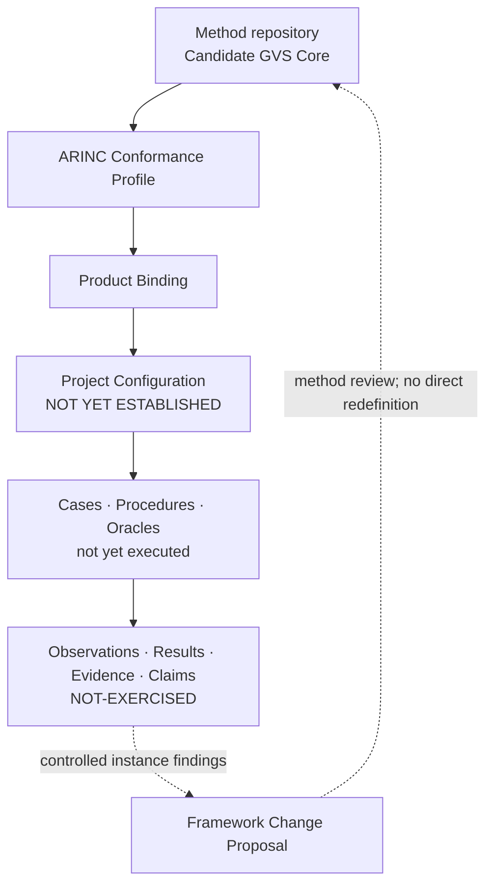

# ARINC 615A Conformance Verification

This repository owns the ARINC 615A **Profile, Product Binding, Project
Configuration, instance engineering, execution records and instance evidence**
used to apply a separately controlled generic verification methodology. It
develops an auditable Test-and-Analysis approach, with Review and Inspection
gates controlling artifacts and claims.

The root README is the sole human-readable current-status surface. Atomic
baselines, change requests, reviews and historical evidence remain immutable
records at commit-bound locations.

## Project architecture



The method repository owns the Generic Core. This repository owns the ARINC
refinement and all configuration- and execution-specific artifacts. Instance
findings may support, qualify or challenge candidate method claims, but cannot
silently redefine the Core.

<!-- project-status:start -->
## Current development picture

| Dimension | Controlled state |
|---|---|
| Repository role | ARINC 615A Profile / Binding / Configuration / instance engineering and evidence owner |
| Current release | [`RB-2026-001-v4.3.1`](docs/control/baselines/RB-2026-001-v4.3.1.md) / annotated [`v4.3.1`](https://github.com/ZhangChi0727/arinc-615a-conformance/tree/v4.3.1) |
| Method input | Candidate GVS Core 0.3 at [`48dd8232b7ef`](https://github.com/ZhangChi0727/complex-system-verification-assurance/commit/48dd8232b7efe6b0dba3fcb75dfc154d034d2b0b) |
| Protocol source | `ARINC-615A-3` / edition `615A-3` / wire version `A4` |
| Bounded source and open dependency | `ARINC-665-5`, `ARINC-664-2`, `ARINC-664-3`, `ARINC-645` (BOUNDED-ACTIVE); `ARINC-664-4`, `ARINC-664-7` (CONDITIONAL-DEPLOYMENT); ARINC-645 `OPEN-DEPENDENCY`, ARINC-664-3 `OPEN-DEPENDENCY`, ARINC-664-4 `OPEN-DEPENDENCY`, ARINC-664-7 `OPEN-DEPENDENCY`, RFC-768 `OPEN-DEPENDENCY`, RFC-791 `OPEN-DEPENDENCY`, RFC-1123 `OPEN-DEPENDENCY`, RFC-1350 `OPEN-DEPENDENCY`, RFC-1785 `OPEN-DEPENDENCY`, RFC-2347 `OPEN-DEPENDENCY`, RFC-2348 `OPEN-DEPENDENCY`, RFC-2349 `OPEN-DEPENDENCY`, RFC-1122 `OPEN-DEPENDENCY` |
| Technical direction | `LIGHTWEIGHT-OBSERVABLE-TIMED-EFSM` / `CL-TAV` / platform `deferred: TTCN-3` |
| Delivery position | current `M2` / next `M3` / disposition `ADOPT` |
| Activation boundary | merge evidence `EXTERNAL-VERIFICATION-REQUIRED` / approval `NOT-AUTOMATED` |
| Technical controls | [`source register`](configs/research/controlled_sources.json), [`activation control`](docs/control/changes/CR-2026-012.md), [`technical decisions`](docs/control/decisions/DESIGN_DECISIONS.md), [`M1 package`](configs/requirements/arinc_615a3_m1_crs.json), [`generated M1 review view`](docs/control/requirements/ARINC615A3_M1_CRS_REVIEW_VIEW.md), [`M2 package`](configs/models/arinc_615a3_m2_model.json), [`generated M2 review view`](docs/control/models/ARINC615A3_M2_MODEL_REVIEW_VIEW.md) |
| Current CRS inventory | `ARINC615A3-M1-CRS` / `M1-CANDIDATE-25` / coverage 3153 / requirements 863 |
| Third handshake | `COMPLETE` |
| Compatibility | `REVIEWED-COMPATIBLE-WITH-QUALIFICATION` under Q-01–Q-09 |
| Project Configuration | `NOT YET ESTABLISHED` |
| Instance evaluation | `NOT-EXERCISED` |
| RQ8 | `OPEN` |

## Current increment

**TAES Regular Paper first-draft manuscript**

- Convert the accepted CL-TAV method, algorithm contracts and experiment protocol into a compilable IEEE TAES Regular Paper first draft under CR-2026-015 / DD-037. The eight outline chapters become sections I–VIII. The project page budget is a main PDF of at most 10 pages including references, with reserved result layout; the supplement is compiled separately.
- Keep C1/C2 and CL-RQ1–CL-RQ3. Do not invent confirmatory numbers. Placeholders carry unique IDs, categories, dependencies and completion conditions. Author, affiliation, funding, ranking and fees stay pending institutional inputs.
- Do not change CRS, M2, src, source-audit semantics, accepted algorithm control logic, capabilities or Configuration. This increment is not submission, not M3 and not a tag.

State changes:

- Writing increment on one Draft PR under CR-2026-015 / DD-037; M3 remains blocked.
- currentStop remains EXECUTABLE-FOUNDATION-GATE for M3 implementation.

Unchanged boundaries:

- Candidate GVS Core and compatibility-disposition identities remain separate and unchanged.
- The 18 source mapping rows, 7 instance-only rows and Q-01 through Q-09 remain unchanged.
- Project Configuration is NOT YET ESTABLISHED; instance evaluation is NOT-EXERCISED; RQ8 remains OPEN.
- Protocol conformance, certification readiness and authority acceptance remain false; no baseline or tag is created.
- This increment creates no codec, executable EFSM engine, verification case, procedure, execution evidence or Project Configuration.

## Current stop

`EXECUTABLE-FOUNDATION-GATE` — **NOT YET ESTABLISHED**: This stop still blocks M3 implementation. The bounded M2 ordinary merge is recorded; that approval is not transplanted onto expanded CRS. The CL-TAV Draft candidate is M1-CANDIDATE-25 with 615A-triggered 645 SOURCE/SEMANTIC bind, FIND abort non-waiver, bound RFC 1123/791, 664-7 latency/jitter/MAC and remaining P7 switch/Attachment-2 contracts including the VL-sum max_jitter equation, source-owned 4.7.3.2 filtering-table members, 664P4-1 address-rule leaves for the first 00519 alternative, and combined TFTP end conditions; it is not method/paper/capability/expanded-CRS approval. Independent review must pass, and merge requires explicit authorization. Do not Ready, merge or tag on this increment. The 2026-09-14 DD-029 design-direction acceptance is not independent approval.

## Next development steps

- Request independent review of the TAES first draft and its placeholders on the unique Draft PR. Keep independentMathematicalApproval and independentReviewApproval false. Do not Ready, merge, tag, submit or start M3.
- Keep 665 section 2.3 emitted-not-closed in this PR. ARINC 645 SOURCE/SEMANTIC bind stays capability-open. Bound M2 stays UPLOAD/INFORMATION. FIND clock limited approval stays closed. Do not auto-select Part 4 or activate AFDX.

## 当前开发图景

| 维度 | 受控状态 |
|---|---|
| 仓库角色 | ARINC 615A Profile、Binding、Configuration、实例工程与证据的权威仓库 |
| 当前发布 | [`RB-2026-001-v4.3.1`](docs/control/baselines/RB-2026-001-v4.3.1.md) / annotated [`v4.3.1`](https://github.com/ZhangChi0727/arinc-615a-conformance/tree/v4.3.1) |
| 方法输入 | Candidate GVS Core 0.3 @ [`48dd8232b7ef`](https://github.com/ZhangChi0727/complex-system-verification-assurance/commit/48dd8232b7efe6b0dba3fcb75dfc154d034d2b0b) |
| 协议来源 | `ARINC-615A-3` / 版次 `615A-3` / 线版本 `A4` |
| 有边界来源与开放依赖 | `ARINC-665-5`, `ARINC-664-2`, `ARINC-664-3`, `ARINC-645` (BOUNDED-ACTIVE); `ARINC-664-4`, `ARINC-664-7` (CONDITIONAL-DEPLOYMENT)；ARINC-645 `OPEN-DEPENDENCY`, ARINC-664-3 `OPEN-DEPENDENCY`, ARINC-664-4 `OPEN-DEPENDENCY`, ARINC-664-7 `OPEN-DEPENDENCY`, RFC-768 `OPEN-DEPENDENCY`, RFC-791 `OPEN-DEPENDENCY`, RFC-1123 `OPEN-DEPENDENCY`, RFC-1350 `OPEN-DEPENDENCY`, RFC-1785 `OPEN-DEPENDENCY`, RFC-2347 `OPEN-DEPENDENCY`, RFC-2348 `OPEN-DEPENDENCY`, RFC-2349 `OPEN-DEPENDENCY`, RFC-1122 `OPEN-DEPENDENCY` |
| 技术方向 | `LIGHTWEIGHT-OBSERVABLE-TIMED-EFSM` / `CL-TAV` / 平台 `deferred: TTCN-3` |
| 交付位置 | 当前 `M2` / 下一 `M3` / 处置 `ADOPT` |
| 激活边界 | 合并证据 `EXTERNAL-VERIFICATION-REQUIRED` / 批准 `NOT-AUTOMATED` |
| 技术控制入口 | [`source register`](configs/research/controlled_sources.json), [`activation control`](docs/control/changes/CR-2026-012.md), [`technical decisions`](docs/control/decisions/DESIGN_DECISIONS.md), [`M1 package`](configs/requirements/arinc_615a3_m1_crs.json), [`generated M1 review view`](docs/control/requirements/ARINC615A3_M1_CRS_REVIEW_VIEW.md), [`M2 package`](configs/models/arinc_615a3_m2_model.json), [`generated M2 review view`](docs/control/models/ARINC615A3_M2_MODEL_REVIEW_VIEW.md) |
| 当前 CRS 清单 | `ARINC615A3-M1-CRS` / `M1-CANDIDATE-25` / coverage 3153 / requirements 863 |
| 第三次握手 | `COMPLETE` |
| 兼容性 | 受 Q-01～Q-09 限定的 `REVIEWED-COMPATIBLE-WITH-QUALIFICATION` |
| Project Configuration | `NOT YET ESTABLISHED` |
| 实例评价 | `NOT-EXERCISED` |
| RQ8 | `OPEN` |

## 本次集成增量

**TAES Regular Paper 初稿**

- 在 CR-2026-015／DD-037 下，把已接受的 CL-TAV 方法、算法合同与实验方案转为可编译的 IEEE TAES Regular Paper 初稿。八节大纲对应第 I–VIII 节。项目页预算为主稿含参考文献不超过 10 页并预留结果版面；补充材料单独编译。
- 保持 C1／C2 与 CL-RQ1–CL-RQ3。不虚构确认性数字。占位具唯一 ID、类别、依赖与完成条件。作者、单位、基金、分区与费用保持待单位确认。
- 不修改 CRS、M2、src、来源审计语义、已接受算法控制逻辑、能力或 Configuration。本增量不是投稿、不是 M3、不是 tag。

状态变化：

- 写作增量在唯一 Draft PR 上以 CR-2026-015／DD-037 交付；M3 保持阻塞。
- 对 M3 实现而言 currentStop 仍为 EXECUTABLE-FOUNDATION-GATE。

保持不变的边界：

- Candidate GVS Core 与兼容性处置身份保持分离且不变。
- 18 个来源映射行、7 个实例专用行及 Q-01～Q-09 保持不变。
- Project Configuration 保持 NOT YET ESTABLISHED；实例评价保持 NOT-EXERCISED；RQ8 保持 OPEN。
- 协议符合性、认证准备度和权威接受保持 false；不创建 baseline 或 tag。
- 本增量不创建 codec、可执行 EFSM 引擎、验证用例、规程、执行证据或 Project Configuration。

## 当前停点

`EXECUTABLE-FOUNDATION-GATE` — **NOT YET ESTABLISHED**：本停点仍禁止 M3 实现。有界 M2 普通合并已记录；该批准不移植到扩大 CRS。CL-TAV Draft 候选为 M1-CANDIDATE-25，含 615A 触发的 645 来源／语义绑定、FIND 中止不豁免、已绑定的 RFC 1123／791、含 VL 求和 max_jitter 方程的 664-7 时延／抖动／MAC 及剩余交换机／附件 2 合同、4.7.3.2 过滤表来源成员、00519 第一条替代路径的 664P4-1 地址规则叶及组合后的 TFTP 结束条件，不是方法／论文／能力／扩大 CRS 批准。须通过独立评审，合并须明确授权。本增量不转 Ready、不合并、不打标签。2026-09-14 对 DD-029 的设计方向接受不是独立批准。

## 下一步开发计划

- 在唯一 Draft PR 上请求对 TAES 初稿及其占位做独立评审。保持 independentMathematicalApproval 与 independentReviewApproval 为 false。不转 Ready、不合并、不打标签、不投稿、不启动 M3。
- 665 §2.3 在本 PR 保持已发出未闭合。ARINC 645 来源／语义绑定保持能力未建立。绑定 M2 仍为 UPLOAD／INFORMATION。FIND 时钟有限批准保持关闭。不自动选定第 4 部分，也不激活 AFDX。
<!-- project-status:end -->

## Read by role / 按角色继续阅读

| Reader | Entry | Purpose |
|---|---|---|
| General reader / 普通读者 | This README and the [current release](https://github.com/ZhangChi0727/arinc-615a-conformance/tree/v4.3.1) | purpose, achieved state and unearned claims |
| Researcher / 研究人员 | [`RESEARCH_CONTROL.md`](docs/research/RESEARCH_CONTROL.md) | method inputs, ARINC refinement, experiments and claims |
| Developer / 开发者 | [`ENGINEERING_CONTROL.md`](docs/engineering/ENGINEERING_CONTROL.md) | implementation, tests, configuration and evidence production |
| Agent | [`project-status.json`](project-status.json) | machine state, stop point, next steps and prohibited actions |
| Tutorial reader / 教程读者 | [`TUTORIAL_CONTROL.md`](docs/tutorial/TUTORIAL_CONTROL.md) | common and ARINC-specific tutorial products |
| Maintainer / 维护者 | [`PROJECT_CONTROL.md`](docs/control/PROJECT_CONTROL.md), [`CHANGE_CONTROL.md`](docs/control/CHANGE_CONTROL.md) | workflow, gates, PR and release discipline |

## Repository structure

```text
README.md                 sole human-readable current-status surface
project-status.json       machine-readable lifecycle and cross-repository state
pyproject.toml             Python package/build/test metadata
.github/                  CI and repository configuration
src/                       verification instrument source
tests/                     executable engineering and governance checks
configs/                   controlled machine-readable inputs and templates
scripts/                   synchronization and validation automation
docs/                      developer control plane and atomic records
artifacts/reports/current/ legacy report path retained for immutable references; not current status
artifacts/reports/archive/ other historical reader reports
artifacts/tutorials/       published tutorial outputs
artifacts/releases/        distributable release packages
artifacts/evidence/        generated evidence packages, normally untracked
local-references/          ignored local research inputs, never published
```

`pyproject.toml` remains at the root because packaging, editable installation,
test discovery and development tools locate it there by convention. It is
machine-facing executable configuration, not a reader report.

## Quick start

```bash
python -m pip install -e ".[dev]"
python scripts/sync_project_overview.py --check
python scripts/check_repo_baseline.py
python -m pytest tests/ -q
```

Do not commit proprietary ARINC or employer-only ICD text. A passing test suite
is engineering evidence, not by itself a conformance proof, certification
finding or scientific result.

不得提交专有 ARINC 或雇主内部 ICD 原文。测试通过属于工程证据，本身不是符合性证明、
认证结论或科学研究结果。
