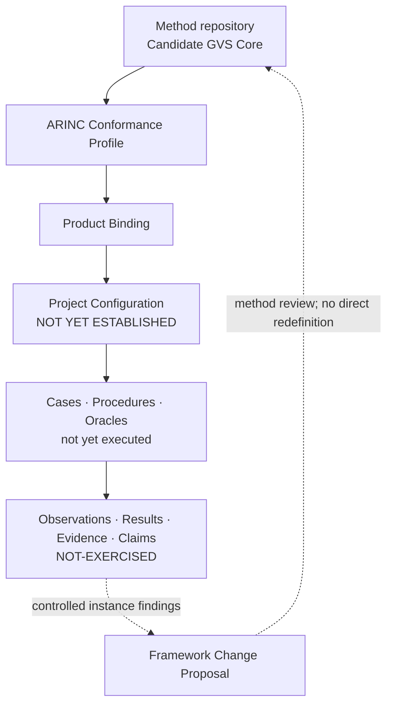

# ARINC 615A Conformance Verification

This repository owns the ARINC 615A **Profile, Product Binding, Project
Configuration, instance engineering, execution records and instance evidence**
used to apply a separately controlled generic verification methodology. It
develops an auditable Test-and-Analysis approach, with Review and Inspection
gates controlling artifacts and claims.

The root README is the sole human-readable current-status surface. Atomic
baselines, change requests, reviews and historical evidence remain immutable
records at commit-bound locations.

## Project architecture


```mermaid
flowchart TD
    C["Method repository<br/>Candidate GVS Core"] --> P["ARINC Conformance Profile"]
    P --> B["Product Binding"]
    B --> G["Project Configuration<br/>NOT YET ESTABLISHED"]
    G --> V["Cases · Procedures · Oracles<br/>not yet executed"]
    V --> E["Observations · Results · Evidence · Claims<br/>NOT-EXERCISED"]
    E -. "controlled instance findings" .-> F["Framework Change Proposal"]
    F -. "method review; no direct redefinition" .-> C
```

The method repository owns the Generic Core. This repository owns the ARINC
refinement and all configuration- and execution-specific artifacts. Instance
findings may support, qualify or challenge candidate method claims, but cannot
silently redefine the Core.

<!-- project-status:start -->
## Current development picture

| Dimension | Controlled state |
|---|---|
| Repository role | ARINC 615A Profile / Binding / Configuration / instance engineering and evidence owner |
| Current release | [`RB-2026-001-v4.3.1`](docs/control/baselines/RB-2026-001-v4.3.1.md) / annotated [`v4.3.1`](https://github.com/ZhangChi0727/arinc-615a-conformance/tree/v4.3.1) |
| Method input | Candidate GVS Core 0.3 at [`48dd8232b7ef`](https://github.com/ZhangChi0727/complex-system-verification-assurance/commit/48dd8232b7efe6b0dba3fcb75dfc154d034d2b0b) |
| Protocol source | `ARINC-615A-3` / edition `615A-3` / wire version `A4` |
| Bounded source and open dependency | `ARINC-665-5`, `ARINC-664-2`, `ARINC-664-3`, `ARINC-645` (BOUNDED-ACTIVE); `ARINC-664-4`, `ARINC-664-7` (CONDITIONAL-DEPLOYMENT); ARINC-645 `OPEN-DEPENDENCY`, ARINC-664-3 `OPEN-DEPENDENCY`, ARINC-664-4 `OPEN-DEPENDENCY`, ARINC-664-7 `OPEN-DEPENDENCY`, RFC-768 `OPEN-DEPENDENCY`, RFC-791 `OPEN-DEPENDENCY`, RFC-1123 `OPEN-DEPENDENCY`, RFC-1350 `OPEN-DEPENDENCY`, RFC-1785 `OPEN-DEPENDENCY`, RFC-2347 `OPEN-DEPENDENCY`, RFC-2348 `OPEN-DEPENDENCY`, RFC-2349 `OPEN-DEPENDENCY`, RFC-1122 `OPEN-DEPENDENCY` |
| Technical direction | `LIGHTWEIGHT-OBSERVABLE-TIMED-EFSM` / `CL-TAV` / platform `deferred: TTCN-3` |
| Delivery position | current `M2` / next `M3` / disposition `ADOPT` |
| Activation boundary | merge evidence `EXTERNAL-VERIFICATION-REQUIRED` / approval `NOT-AUTOMATED` |
| Technical controls | [`source register`](configs/research/controlled_sources.json), [`activation control`](docs/control/changes/CR-2026-012.md), [`technical decisions`](docs/control/decisions/DESIGN_DECISIONS.md), [`M1 package`](configs/requirements/arinc_615a3_m1_crs.json), [`generated M1 review view`](docs/control/requirements/ARINC615A3_M1_CRS_REVIEW_VIEW.md), [`M2 package`](configs/models/arinc_615a3_m2_model.json), [`generated M2 review view`](docs/control/models/ARINC615A3_M2_MODEL_REVIEW_VIEW.md) |
| Current CRS inventory | `ARINC615A3-M1-CRS` / `M1-CANDIDATE-25` / coverage 3153 / requirements 863 |
| Third handshake | `COMPLETE` |
| Compatibility | `REVIEWED-COMPATIBLE-WITH-QUALIFICATION` under Q-01–Q-09 |
| Project Configuration | `NOT YET ESTABLISHED` |
| Instance evaluation | `NOT-EXERCISED` |
| RQ8 | `OPEN` |

## Current increment

**Accepted CL-TAV first-slice development specification and post-merge input pin**

- Specify the first offline UPLOAD/INFORMATION development slice under CR-2026-016 / DD-038–040: capture identity, reconstruction records, ownership, observation interpretation, bounded history compatibility and traceable reporting.
- Register the local historical corpus as exploratory development input only; file annotation is not wire outcome, independent case conclusion or experimental truth, and unknown metadata remains explicit.
- Bind a finite explicit-path kernel, eight algorithm interfaces, seven experiment interfaces, concrete synthetic contract witnesses and a specification-closed/runtime-unestablished integrity dependency.
- PR #19 was accepted at c9ca381 and squash-merged as 324d832. This follow-up rebinds the M2 input identity to that exact merged tree; the specification is not a tool implementation, confirmation experiment, Configuration, M3 activation, capability or conformance claim.

State changes:

- PR #19 under CR-2026-016 / DD-038–040 is merged; this follow-up corrects only the post-squash M2 input pin. M3 remains blocked.
- currentStop remains EXECUTABLE-FOUNDATION-GATE for M3 implementation.

Unchanged boundaries:

- Candidate GVS Core and compatibility-disposition identities remain separate and unchanged.
- The 18 source mapping rows, 7 instance-only rows and Q-01 through Q-09 remain unchanged.
- Project Configuration is NOT YET ESTABLISHED; instance evaluation is NOT-EXERCISED; RQ8 remains OPEN.
- Protocol conformance, certification readiness and authority acceptance remain false; no baseline or tag is created.
- This increment creates no codec, executable EFSM engine, verification case, procedure, execution evidence or Project Configuration.

## Current stop

`EXECUTABLE-FOUNDATION-GATE` — **NOT YET ESTABLISHED**: This stop still blocks M3 implementation. RR-CLTAV-2026-097 accepted the first-slice offline UPLOAD/INFORMATION development specification at PR #19 Head c9ca381, squash-merged as 324d832. That acceptance is not a tool implementation, runtime integrity result, confirmatory experiment, Project Configuration, expanded-CRS approval or M3 activation. M1-CANDIDATE-25 and its open source dependencies retain their controlled dispositions; the post-merge M2 pin correction changes artifact ancestry only. Further implementation requires separate authorization and evidence.

## Next development steps

- Use the accepted first-slice specification as controlled input for a separately authorized implementation increment. Establish runtime integrity and independent experimental truth before capability or conformance claims; do not start M3 from this specification alone.
- Keep protocol capability and execution boundaries unchanged. The local corpus remains exploratory; unknown topology, clocks, configuration, version and root cause remain explicit, and no capture annotation becomes experimental truth.

## 当前开发图景

| 维度 | 受控状态 |
|---|---|
| 仓库角色 | ARINC 615A Profile、Binding、Configuration、实例工程与证据的权威仓库 |
| 当前发布 | [`RB-2026-001-v4.3.1`](docs/control/baselines/RB-2026-001-v4.3.1.md) / annotated [`v4.3.1`](https://github.com/ZhangChi0727/arinc-615a-conformance/tree/v4.3.1) |
| 方法输入 | Candidate GVS Core 0.3 @ [`48dd8232b7ef`](https://github.com/ZhangChi0727/complex-system-verification-assurance/commit/48dd8232b7efe6b0dba3fcb75dfc154d034d2b0b) |
| 协议来源 | `ARINC-615A-3` / 版次 `615A-3` / 线版本 `A4` |
| 有边界来源与开放依赖 | `ARINC-665-5`, `ARINC-664-2`, `ARINC-664-3`, `ARINC-645` (BOUNDED-ACTIVE); `ARINC-664-4`, `ARINC-664-7` (CONDITIONAL-DEPLOYMENT)；ARINC-645 `OPEN-DEPENDENCY`, ARINC-664-3 `OPEN-DEPENDENCY`, ARINC-664-4 `OPEN-DEPENDENCY`, ARINC-664-7 `OPEN-DEPENDENCY`, RFC-768 `OPEN-DEPENDENCY`, RFC-791 `OPEN-DEPENDENCY`, RFC-1123 `OPEN-DEPENDENCY`, RFC-1350 `OPEN-DEPENDENCY`, RFC-1785 `OPEN-DEPENDENCY`, RFC-2347 `OPEN-DEPENDENCY`, RFC-2348 `OPEN-DEPENDENCY`, RFC-2349 `OPEN-DEPENDENCY`, RFC-1122 `OPEN-DEPENDENCY` |
| 技术方向 | `LIGHTWEIGHT-OBSERVABLE-TIMED-EFSM` / `CL-TAV` / 平台 `deferred: TTCN-3` |
| 交付位置 | 当前 `M2` / 下一 `M3` / 处置 `ADOPT` |
| 激活边界 | 合并证据 `EXTERNAL-VERIFICATION-REQUIRED` / 批准 `NOT-AUTOMATED` |
| 技术控制入口 | [`source register`](configs/research/controlled_sources.json), [`activation control`](docs/control/changes/CR-2026-012.md), [`technical decisions`](docs/control/decisions/DESIGN_DECISIONS.md), [`M1 package`](configs/requirements/arinc_615a3_m1_crs.json), [`generated M1 review view`](docs/control/requirements/ARINC615A3_M1_CRS_REVIEW_VIEW.md), [`M2 package`](configs/models/arinc_615a3_m2_model.json), [`generated M2 review view`](docs/control/models/ARINC615A3_M2_MODEL_REVIEW_VIEW.md) |
| 当前 CRS 清单 | `ARINC615A3-M1-CRS` / `M1-CANDIDATE-25` / coverage 3153 / requirements 863 |
| 第三次握手 | `COMPLETE` |
| 兼容性 | 受 Q-01～Q-09 限定的 `REVIEWED-COMPATIBLE-WITH-QUALIFICATION` |
| Project Configuration | `NOT YET ESTABLISHED` |
| 实例评价 | `NOT-EXERCISED` |
| RQ8 | `OPEN` |

## 本次集成增量

**已接受的 CL-TAV 首轮开发规格及合并后输入重钉**

- 在 CR-2026-016／DD-038～040 下规格化首轮离线 UPLOAD／INFORMATION 开发切片：捕获身份、重建记录、所有权、观测解释、有界历史相容更新和可追踪报告。
- 本地历史语料仅登记为探索性开发输入；文件注释不等于线上结果、独立案例结论或实验真值，未知元数据保持显式。
- 绑定有限显式路径内核、八个算法接口、七个实验接口、具体合成合同见证，以及规格已关闭但运行能力未建立的完整性依赖。
- PR #19 在 c9ca381 获接受，并以 324d832 压缩合并。本次后处理将 M2 输入身份重钉至相同的合入树；该规格不是工具实现、确认性实验、Configuration、M3 激活、能力或符合性主张。

状态变化：

- CR-2026-016／DD-038～040 下的 PR #19 已合并；本次后处理仅修正压缩合并后的 M2 输入锚点。M3 保持阻塞。
- 对 M3 实现而言 currentStop 仍为 EXECUTABLE-FOUNDATION-GATE。

保持不变的边界：

- Candidate GVS Core 与兼容性处置身份保持分离且不变。
- 18 个来源映射行、7 个实例专用行及 Q-01～Q-09 保持不变。
- Project Configuration 保持 NOT YET ESTABLISHED；实例评价保持 NOT-EXERCISED；RQ8 保持 OPEN。
- 协议符合性、认证准备度和权威接受保持 false；不创建 baseline 或 tag。
- 本增量不创建 codec、可执行 EFSM 引擎、验证用例、规程、执行证据或 Project Configuration。

## 当前停点

`EXECUTABLE-FOUNDATION-GATE` — **NOT YET ESTABLISHED**：本停点仍禁止 M3 实现。RR-CLTAV-2026-097 接受了 PR #19 Head c9ca381 的首轮离线 UPLOAD／INFORMATION 开发规格，随后以 324d832 压缩合并。该接受不等于工具实现、运行完整性结果、确认性实验、Project Configuration、扩大 CRS 批准或 M3 激活。M1-CANDIDATE-25 及其开放来源依赖保持受控处置；合并后的 M2 重钉只改变制品祖先身份。后续实现须单独授权并提供证据。

## 下一步开发计划

- 将已接受的首轮规格作为后续单独授权实现增量的受控输入。建立运行完整性与独立实验真值后方可提出能力或符合性主张；不得仅凭本规格启动 M3。
- 保持协议能力与执行边界不变。本地语料继续仅作探索用途；未知拓扑、时钟、配置、版本和根因保持显式，任何捕获注释不得成为实验真值。
<!-- project-status:end -->

## Read by role / 按角色继续阅读

| Reader | Entry | Purpose |
|---|---|---|
| General reader / 普通读者 | This README and the [current release](https://github.com/ZhangChi0727/arinc-615a-conformance/tree/v4.3.1) | purpose, achieved state and unearned claims |
| Researcher / 研究人员 | [`RESEARCH_CONTROL.md`](docs/research/RESEARCH_CONTROL.md) | method inputs, ARINC refinement, experiments and claims |
| Developer / 开发者 | [`ENGINEERING_CONTROL.md`](docs/engineering/ENGINEERING_CONTROL.md) | implementation, tests, configuration and evidence production |
| Agent | [`project-status.json`](project-status.json) | machine state, stop point, next steps and prohibited actions |
| Tutorial reader / 教程读者 | [`TUTORIAL_CONTROL.md`](docs/tutorial/TUTORIAL_CONTROL.md) | common and ARINC-specific tutorial products |
| Maintainer / 维护者 | [`PROJECT_CONTROL.md`](docs/control/PROJECT_CONTROL.md), [`CHANGE_CONTROL.md`](docs/control/CHANGE_CONTROL.md) | workflow, gates, PR and release discipline |

## Repository structure

```text
README.md                 sole human-readable current-status surface
project-status.json       machine-readable lifecycle and cross-repository state
pyproject.toml             Python package/build/test metadata
.github/                  CI and repository configuration
src/                       verification instrument source
tests/                     executable engineering and governance checks
configs/                   controlled machine-readable inputs and templates
scripts/                   synchronization and validation automation
docs/                      developer control plane and atomic records
artifacts/reports/current/ legacy report path retained for immutable references; not current status
artifacts/reports/archive/ other historical reader reports
artifacts/tutorials/       published tutorial outputs
artifacts/releases/        distributable release packages
artifacts/evidence/        generated evidence packages, normally untracked
local-references/          ignored local research inputs, never published
```

`pyproject.toml` remains at the root because packaging, editable installation,
test discovery and development tools locate it there by convention. It is
machine-facing executable configuration, not a reader report.

## Quick start

```bash
python -m pip install -e ".[dev]"
python scripts/sync_project_overview.py --check
python scripts/check_repo_baseline.py
python -m pytest tests/ -q
```

Do not commit proprietary ARINC or employer-only ICD text. A passing test suite
is engineering evidence, not by itself a conformance proof, certification
finding or scientific result.

不得提交专有 ARINC 或雇主内部 ICD 原文。测试通过属于工程证据，本身不是符合性证明、
认证结论或科学研究结果。
