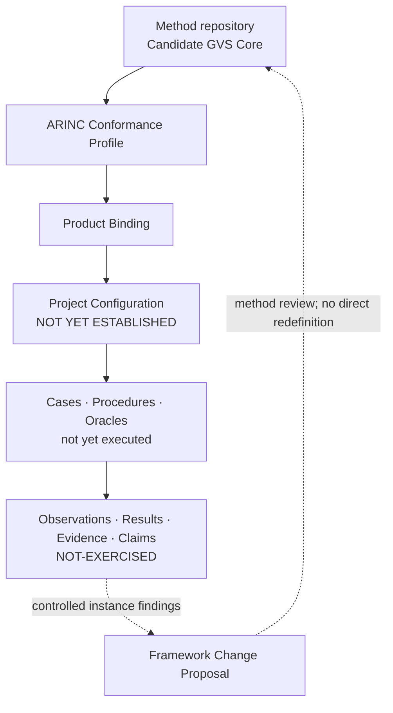

# ARINC 615A Conformance Verification

This repository owns the ARINC 615A **Profile, Product Binding, Project
Configuration, instance engineering, execution records and instance evidence**
used to apply a separately controlled generic verification methodology. It
develops an auditable Test-and-Analysis approach, with Review and Inspection
gates controlling artifacts and claims.

The root README is the sole human-readable current-status surface. Atomic
baselines, change requests, reviews and historical evidence remain immutable
records at commit-bound locations.

## Project architecture


```mermaid
flowchart TD
    C["Method repository<br/>Candidate GVS Core"] --> P["ARINC Conformance Profile"]
    P --> B["Product Binding"]
    B --> G["Project Configuration<br/>NOT YET ESTABLISHED"]
    G --> V["Cases · Procedures · Oracles<br/>not yet executed"]
    V --> E["Observations · Results · Evidence · Claims<br/>NOT-EXERCISED"]
    E -. "controlled instance findings" .-> F["Framework Change Proposal"]
    F -. "method review; no direct redefinition" .-> C
```

The method repository owns the Generic Core. This repository owns the ARINC
refinement and all configuration- and execution-specific artifacts. Instance
findings may support, qualify or challenge candidate method claims, but cannot
silently redefine the Core.

<!-- project-status:start -->
## Current development picture

| Dimension | Controlled state |
|---|---|
| Repository role | ARINC 615A Profile / Binding / Configuration / instance engineering and evidence owner |
| Current release | [`RB-2026-001-v4.3.1`](docs/control/baselines/RB-2026-001-v4.3.1.md) / annotated [`v4.3.1`](https://github.com/ZhangChi0727/arinc-615a-conformance/tree/v4.3.1) |
| Method input | Candidate GVS Core 0.3 at [`48dd8232b7ef`](https://github.com/ZhangChi0727/complex-system-verification-assurance/commit/48dd8232b7efe6b0dba3fcb75dfc154d034d2b0b) |
| Protocol source | `ARINC-615A-3` / edition `615A-3` / wire version `A4` |
| Bounded source and open dependency | `ARINC-665-5`, `ARINC-664-2`, `ARINC-664-3`, `ARINC-645` (BOUNDED-ACTIVE); `ARINC-664-4`, `ARINC-664-7` (CONDITIONAL-DEPLOYMENT); ARINC-645 `OPEN-DEPENDENCY`, ARINC-664-3 `OPEN-DEPENDENCY`, ARINC-664-4 `OPEN-DEPENDENCY`, ARINC-664-7 `OPEN-DEPENDENCY`, RFC-768 `OPEN-DEPENDENCY`, RFC-791 `OPEN-DEPENDENCY`, RFC-1123 `OPEN-DEPENDENCY`, RFC-1350 `OPEN-DEPENDENCY`, RFC-1785 `OPEN-DEPENDENCY`, RFC-2347 `OPEN-DEPENDENCY`, RFC-2348 `OPEN-DEPENDENCY`, RFC-2349 `OPEN-DEPENDENCY`, RFC-1122 `OPEN-DEPENDENCY` |
| Technical direction | `LIGHTWEIGHT-OBSERVABLE-TIMED-EFSM` / `CL-TAV` / platform `deferred: TTCN-3` |
| Delivery position | current `M2` / next `M3` / disposition `ADOPT` |
| Activation boundary | merge evidence `EXTERNAL-VERIFICATION-REQUIRED` / approval `NOT-AUTOMATED` |
| Technical controls | [`source register`](configs/research/controlled_sources.json), [`activation control`](docs/control/changes/CR-2026-012.md), [`technical decisions`](docs/control/decisions/DESIGN_DECISIONS.md), [`M1 package`](configs/requirements/arinc_615a3_m1_crs.json), [`generated M1 review view`](docs/control/requirements/ARINC615A3_M1_CRS_REVIEW_VIEW.md), [`M2 package`](configs/models/arinc_615a3_m2_model.json), [`generated M2 review view`](docs/control/models/ARINC615A3_M2_MODEL_REVIEW_VIEW.md) |
| Current CRS inventory | `ARINC615A3-M1-CRS` / `M1-CANDIDATE-25` / coverage 3153 / requirements 863 |
| Third handshake | `COMPLETE` |
| Compatibility | `REVIEWED-COMPATIBLE-WITH-QUALIFICATION` under Q-01–Q-09 |
| Project Configuration | `NOT YET ESTABLISHED` |
| Instance evaluation | `NOT-EXERCISED` |
| RQ8 | `OPEN` |

## Current increment

**Parallel CL-TAV offline intake and TAES evidence-integration candidates**

- CR-2026-017 / DD-041 authorizes a separately owned, read-only offline capture-to-evidence engineering candidate: packet identity, finite IPv4/UDP/TFTP reconstruction, bounded UPLOAD/INFORMATION events and traceable reporting; it remains subject to independent Draft-PR review.
- CR-2026-018 / DD-042 integrates accepted literature evidence into the TAES draft, bibliography, bounded C1/C2 wording and evaluation accounting without changing algorithms, interfaces or experiment arms.
- Both lines began at c5296aedef961ac3d5846ea9ef28847eea928132 in independent worktrees and require serial reconciliation; the later line preserves both CR/DD records and is reviewed on its new head.
- CR-2026-020 / DD-044 adds nine source-bound, transactional Draw.io model redraw candidates for IEEE TAES visual review; PlantUML remains authority and every redraw remains DRAFT-REDRAW.
- The local historical corpus remains exploratory development input only. No confirmatory result, implementation completion, Configuration, capability, conformance, independent scientific approval, submission, baseline or tag is created.

State changes:

- CR-2026-017 / DD-041 authorize one bounded offline intake implementation increment on a Draft PR; M3 remains blocked.
- CR-2026-018 / DD-042 authorizes evidence-bounded TAES positioning and evaluation accounting without changing the controlled method.
- CR-2026-020 / DD-044 authorizes only an editable publication-redraw workflow with finite source bindings, topology checks and draft exports; reader-figure promotion remains blocked on human review.
- currentStop remains EXECUTABLE-FOUNDATION-GATE for M3, active execution and capability claims.

Unchanged boundaries:

- Candidate GVS Core and compatibility-disposition identities remain separate and unchanged.
- The 18 source mapping rows, 7 instance-only rows and Q-01 through Q-09 remain unchanged.
- Project Configuration is NOT YET ESTABLISHED; instance evaluation is NOT-EXERCISED; RQ8 remains OPEN.
- Protocol conformance, certification readiness and authority acceptance remain false; no baseline or tag is created.
- This increment creates no active codec/service engine, executable CL-TAV EFSM/solver, verification verdict, controlled execution evidence or Project Configuration.

## Current stop

`EXECUTABLE-FOUNDATION-GATE` — **NOT YET ESTABLISHED**: This stop still blocks M3, active protocol execution and capability claims. RR-CLTAV-2026-097 accepted the first-slice offline UPLOAD/INFORMATION development specification at PR #19 Head c9ca381, squash-merged as 324d832; PR #20 rebounded the M2 input to c5296aed. CR-2026-017 / DD-041 separately authorize only a bounded, read-only offline intake implementation with evidence output. That narrow authorization is not a runtime-integrity result, confirmatory experiment, Project Configuration, expanded-CRS approval or M3 activation. M1-CANDIDATE-25 and its open source dependencies retain their controlled dispositions.

## Next development steps

- Complete the authorized offline intake increment under CR-2026-017 / DD-041, then obtain independent review on its unchanged Draft PR Head. Establish runtime integrity and independent experimental truth before capability or conformance claims; do not start M3 from this implementation alone.
- Complete final-size visual review and independent final-head review of the CR-2026-020 model redraw candidates before replacing any reader SVG or manuscript figure.
- Keep protocol capability and execution boundaries unchanged. The local corpus remains exploratory; unknown topology, clocks, configuration, version and root cause remain explicit, and no capture annotation becomes experimental truth.

## 当前开发图景

| 维度 | 受控状态 |
|---|---|
| 仓库角色 | ARINC 615A Profile、Binding、Configuration、实例工程与证据的权威仓库 |
| 当前发布 | [`RB-2026-001-v4.3.1`](docs/control/baselines/RB-2026-001-v4.3.1.md) / annotated [`v4.3.1`](https://github.com/ZhangChi0727/arinc-615a-conformance/tree/v4.3.1) |
| 方法输入 | Candidate GVS Core 0.3 @ [`48dd8232b7ef`](https://github.com/ZhangChi0727/complex-system-verification-assurance/commit/48dd8232b7efe6b0dba3fcb75dfc154d034d2b0b) |
| 协议来源 | `ARINC-615A-3` / 版次 `615A-3` / 线版本 `A4` |
| 有边界来源与开放依赖 | `ARINC-665-5`, `ARINC-664-2`, `ARINC-664-3`, `ARINC-645` (BOUNDED-ACTIVE); `ARINC-664-4`, `ARINC-664-7` (CONDITIONAL-DEPLOYMENT)；ARINC-645 `OPEN-DEPENDENCY`, ARINC-664-3 `OPEN-DEPENDENCY`, ARINC-664-4 `OPEN-DEPENDENCY`, ARINC-664-7 `OPEN-DEPENDENCY`, RFC-768 `OPEN-DEPENDENCY`, RFC-791 `OPEN-DEPENDENCY`, RFC-1123 `OPEN-DEPENDENCY`, RFC-1350 `OPEN-DEPENDENCY`, RFC-1785 `OPEN-DEPENDENCY`, RFC-2347 `OPEN-DEPENDENCY`, RFC-2348 `OPEN-DEPENDENCY`, RFC-2349 `OPEN-DEPENDENCY`, RFC-1122 `OPEN-DEPENDENCY` |
| 技术方向 | `LIGHTWEIGHT-OBSERVABLE-TIMED-EFSM` / `CL-TAV` / 平台 `deferred: TTCN-3` |
| 交付位置 | 当前 `M2` / 下一 `M3` / 处置 `ADOPT` |
| 激活边界 | 合并证据 `EXTERNAL-VERIFICATION-REQUIRED` / 批准 `NOT-AUTOMATED` |
| 技术控制入口 | [`source register`](configs/research/controlled_sources.json), [`activation control`](docs/control/changes/CR-2026-012.md), [`technical decisions`](docs/control/decisions/DESIGN_DECISIONS.md), [`M1 package`](configs/requirements/arinc_615a3_m1_crs.json), [`generated M1 review view`](docs/control/requirements/ARINC615A3_M1_CRS_REVIEW_VIEW.md), [`M2 package`](configs/models/arinc_615a3_m2_model.json), [`generated M2 review view`](docs/control/models/ARINC615A3_M2_MODEL_REVIEW_VIEW.md) |
| 当前 CRS 清单 | `ARINC615A3-M1-CRS` / `M1-CANDIDATE-25` / coverage 3153 / requirements 863 |
| 第三次握手 | `COMPLETE` |
| 兼容性 | 受 Q-01～Q-09 限定的 `REVIEWED-COMPATIBLE-WITH-QUALIFICATION` |
| Project Configuration | `NOT YET ESTABLISHED` |
| 实例评价 | `NOT-EXERCISED` |
| RQ8 | `OPEN` |

## 本次集成增量

**并行的 CL-TAV 离线接入与 TAES 证据集成候选**

- CR-2026-017／DD-041 授权一条单独负责、只读的“捕获到证据”离线工程候选线：数据包身份、有限 IPv4／UDP／TFTP 重建、有界 UPLOAD／INFORMATION 事件和可追踪报告；它仍须在 Draft PR 上接受独立评审。
- CR-2026-018／DD-042 在不改变算法、接口和实验臂的前提下，把已接受文献证据融入 TAES 初稿、参考文献、有界 C1／C2 措辞与评价记账。
- 两条线均从 c5296aedef961ac3d5846ea9ef28847eea928132 起步，在独立工作树开发并需要串行协调；后合入者保留两套 CR／DD 记录并在新 Head 上接受评审。
- CR-2026-020／DD-044 增加九张具来源绑定、事务生成的 IEEE TAES Draw.io 模型图候选；PlantUML 保持权威，全部重绘保持 DRAFT-REDRAW。
- 本地历史语料继续仅作探索性开发输入。本增量不产生确认性结果、实现完成、Configuration、能力、符合性、独立科学批准、投稿、baseline 或 tag。

状态变化：

- CR-2026-017／DD-041 授权在 Draft PR 上实施一个有界离线接入增量；M3 保持阻塞。
- CR-2026-018／DD-042 授权有证据边界的 TAES 定位与评价记账，不改变受控方法。
- CR-2026-020／DD-044 仅授权具有限来源绑定、拓扑检查和草稿导出的可编辑论文重绘工作流；reader 图晋级仍等待人工评审。
- 对 M3、主动执行和能力主张而言，currentStop 仍为 EXECUTABLE-FOUNDATION-GATE。

保持不变的边界：

- Candidate GVS Core 与兼容性处置身份保持分离且不变。
- 18 个来源映射行、7 个实例专用行及 Q-01～Q-09 保持不变。
- Project Configuration 保持 NOT YET ESTABLISHED；实例评价保持 NOT-EXERCISED；RQ8 保持 OPEN。
- 协议符合性、认证准备度和权威接受保持 false；不创建 baseline 或 tag。
- 本增量不创建主动 codec／服务引擎、可执行 CL-TAV EFSM／求解器、验证判定、受控执行证据或 Project Configuration。

## 当前停点

`EXECUTABLE-FOUNDATION-GATE` — **NOT YET ESTABLISHED**：本停点仍禁止 M3、主动协议执行和能力主张。RR-CLTAV-2026-097 接受了 PR #19 Head c9ca381 的首轮离线 UPLOAD／INFORMATION 开发规格，随后以 324d832 压缩合并；PR #20 将 M2 输入重钉至 c5296aed。CR-2026-017／DD-041 仅单独授权一个输出证据的有界、只读离线接入实现。该狭窄授权不等于运行完整性结果、确认性实验、Project Configuration、扩大 CRS 批准或 M3 激活。M1-CANDIDATE-25 及其开放来源依赖保持受控处置。

## 下一步开发计划

- 完成 CR-2026-017／DD-041 下的授权离线接入增量，再在不变 Draft PR Head 上取得独立评审。建立运行完整性与独立实验真值后方可提出能力或符合性主张；不得仅凭本实现启动 M3。
- 在替换任何 reader SVG 或稿件图之前，完成 CR-2026-020 模型重绘候选的最终尺寸目检和最终 Head 独立评审。
- 保持协议能力与执行边界不变。本地语料继续仅作探索用途；未知拓扑、时钟、配置、版本和根因保持显式，任何捕获注释不得成为实验真值。
<!-- project-status:end -->

## Read by role / 按角色继续阅读

| Reader | Entry | Purpose |
|---|---|---|
| General reader / 普通读者 | This README and the [current release](https://github.com/ZhangChi0727/arinc-615a-conformance/tree/v4.3.1) | purpose, achieved state and unearned claims |
| Researcher / 研究人员 | [`RESEARCH_CONTROL.md`](docs/research/RESEARCH_CONTROL.md) | method inputs, ARINC refinement, experiments and claims |
| Developer / 开发者 | [`ENGINEERING_CONTROL.md`](docs/engineering/ENGINEERING_CONTROL.md) | implementation, tests, configuration and evidence production |
| Agent | [`project-status.json`](project-status.json) | machine state, stop point, next steps and prohibited actions |
| Tutorial reader / 教程读者 | [`TUTORIAL_CONTROL.md`](docs/tutorial/TUTORIAL_CONTROL.md) | common and ARINC-specific tutorial products |
| Maintainer / 维护者 | [`PROJECT_CONTROL.md`](docs/control/PROJECT_CONTROL.md), [`CHANGE_CONTROL.md`](docs/control/CHANGE_CONTROL.md) | workflow, gates, PR and release discipline |

## Repository structure

```text
README.md                 sole human-readable current-status surface
project-status.json       machine-readable lifecycle and cross-repository state
pyproject.toml             Python package/build/test metadata
.github/                  CI and repository configuration
src/                       verification instrument source
tests/                     executable engineering and governance checks
configs/                   controlled machine-readable inputs and templates
scripts/                   synchronization and validation automation
docs/                      developer control plane and atomic records
artifacts/reports/current/ legacy report path retained for immutable references; not current status
artifacts/reports/archive/ other historical reader reports
artifacts/tutorials/       published tutorial outputs
artifacts/releases/        distributable release packages
artifacts/evidence/        generated evidence packages, normally untracked
local-references/          ignored local research inputs, never published
```

`pyproject.toml` remains at the root because packaging, editable installation,
test discovery and development tools locate it there by convention. It is
machine-facing executable configuration, not a reader report.

## Quick start

```bash
python -m pip install -e ".[dev]"
python scripts/sync_project_overview.py --check
python scripts/check_repo_baseline.py
python -m pytest tests/ -q
```

Do not commit proprietary ARINC or employer-only ICD text. A passing test suite
is engineering evidence, not by itself a conformance proof, certification
finding or scientific result.

不得提交专有 ARINC 或雇主内部 ICD 原文。测试通过属于工程证据，本身不是符合性证明、
认证结论或科学研究结果。
