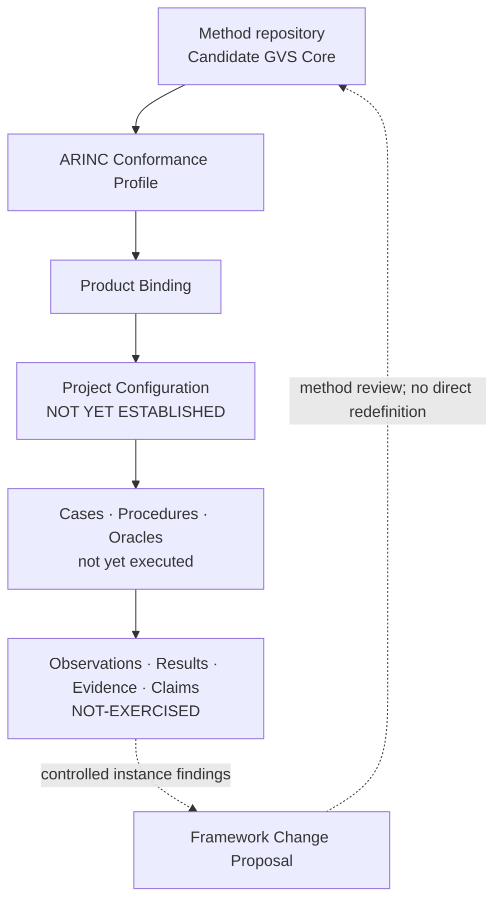

# ARINC 615A Conformance Verification

This repository owns the ARINC 615A **Profile, Product Binding, Project
Configuration, instance engineering, execution records and instance evidence**
used to apply a separately controlled generic verification methodology. It
develops an auditable Test-and-Analysis approach, with Review and Inspection
gates controlling artifacts and claims.

The root README is the sole human-readable current-status surface. Atomic
baselines, change requests, reviews and historical evidence remain immutable
records at commit-bound locations.

## Project architecture


```mermaid
flowchart TD
    C["Method repository<br/>Candidate GVS Core"] --> P["ARINC Conformance Profile"]
    P --> B["Product Binding"]
    B --> G["Project Configuration<br/>NOT YET ESTABLISHED"]
    G --> V["Cases · Procedures · Oracles<br/>not yet executed"]
    V --> E["Observations · Results · Evidence · Claims<br/>NOT-EXERCISED"]
    E -. "controlled instance findings" .-> F["Framework Change Proposal"]
    F -. "method review; no direct redefinition" .-> C
```

The method repository owns the Generic Core. This repository owns the ARINC
refinement and all configuration- and execution-specific artifacts. Instance
findings may support, qualify or challenge candidate method claims, but cannot
silently redefine the Core.

<!-- project-status:start -->
## Current development picture

| Dimension | Controlled state |
|---|---|
| Repository role | ARINC 615A Profile / Binding / Configuration / instance engineering and evidence owner |
| Current release | [`RB-2026-001-v4.3.1`](docs/control/baselines/RB-2026-001-v4.3.1.md) / annotated [`v4.3.1`](https://github.com/ZhangChi0727/arinc-615a-conformance/tree/v4.3.1) |
| Method input | Candidate GVS Core 0.3 at [`48dd8232b7ef`](https://github.com/ZhangChi0727/complex-system-verification-assurance/commit/48dd8232b7efe6b0dba3fcb75dfc154d034d2b0b) |
| Protocol source | `ARINC-615A-3` / edition `615A-3` / wire version `A4` |
| Bounded source and open dependency | `ARINC-665-5`, `ARINC-664-2`, `ARINC-664-3`, `ARINC-645` (BOUNDED-ACTIVE); `ARINC-664-4`, `ARINC-664-7` (CONDITIONAL-DEPLOYMENT); ARINC-645 `OPEN-DEPENDENCY`, ARINC-664-3 `OPEN-DEPENDENCY`, ARINC-664-4 `OPEN-DEPENDENCY`, ARINC-664-7 `OPEN-DEPENDENCY`, RFC-768 `OPEN-DEPENDENCY`, RFC-791 `OPEN-DEPENDENCY`, RFC-1123 `OPEN-DEPENDENCY`, RFC-1350 `OPEN-DEPENDENCY`, RFC-1785 `OPEN-DEPENDENCY`, RFC-2347 `OPEN-DEPENDENCY`, RFC-2348 `OPEN-DEPENDENCY`, RFC-2349 `OPEN-DEPENDENCY`, RFC-1122 `OPEN-DEPENDENCY` |
| Technical direction | `LIGHTWEIGHT-OBSERVABLE-TIMED-EFSM` / `CL-TAV` / platform `deferred: TTCN-3` |
| Delivery position | current `M2` / next `M3` / disposition `ADOPT` |
| Activation boundary | merge evidence `EXTERNAL-VERIFICATION-REQUIRED` / approval `NOT-AUTOMATED` |
| Technical controls | [`source register`](configs/research/controlled_sources.json), [`activation control`](docs/control/changes/CR-2026-012.md), [`technical decisions`](docs/control/decisions/DESIGN_DECISIONS.md), [`M1 package`](configs/requirements/arinc_615a3_m1_crs.json), [`generated M1 review view`](docs/control/requirements/ARINC615A3_M1_CRS_REVIEW_VIEW.md), [`M2 package`](configs/models/arinc_615a3_m2_model.json), [`generated M2 review view`](docs/control/models/ARINC615A3_M2_MODEL_REVIEW_VIEW.md) |
| Current CRS inventory | `ARINC615A3-M1-CRS` / `M1-CANDIDATE-25` / coverage 3153 / requirements 863 |
| Third handshake | `COMPLETE` |
| Compatibility | `REVIEWED-COMPATIBLE-WITH-QUALIFICATION` under Q-01–Q-09 |
| Project Configuration | `NOT YET ESTABLISHED` |
| Instance evaluation | `NOT-EXERCISED` |
| RQ8 | `OPEN` |

## Current increment

**Draft 615A UPLOAD control-slice scenario candidate with bounded finite reference-runtime foundation**

- CR-2026-017 / DD-041 delivered the separately owned, read-only offline capture-to-evidence increment merged as eddec443; its bounded evidence scope remains unchanged.
- CR-2026-018 / DD-042 integrated accepted literature evidence into bounded C1/C2 wording and evaluation accounting without changing algorithms, interfaces or experiment arms.
- PR #23 was independently accepted at Head 04b7c56eb70e458cec46e54bd7b37aaa9185cc7f and squash-merged as 868ee3c3e99bee2bcb0a2aedb206fe15d2a4e0e9; main CI 38864201591 passed. CR-2026-019 / DD-043 remains a bounded design authority, not run admission.
- PR #24 was merged as 4d3b013; CR-2026-020 / DD-044 governs its versioned editable model-figure candidates. The current nine remain DRAFT-REDRAW candidates; semantic review, final-size acceptance, downstream migration, and promotion remain separate pending human decisions.
- PR #25 was independently accepted and squash-merged as c577f34e. It introduced the bounded finite CL-TAV reference-runtime foundation: verified contract/model/projection identities, one-clock exact-rational propagation, conservative limits, compact content-addressed source records, contract-bound in-process session coordination, and raw observation ownership/timing assessment. It establishes neither runtime integrity, IUT execution, conformance, nor M3 admission.
- Draft PR #26 now contains only the G0/A source-bound 615A UPLOAD LUR-start scenario contract, generated bilingual reader view, contract checker and test-only session-seam witnesses. It awaits independent H-A review before any loader/target-hardware object implementation; it does not admit an experiment or establish a protocol capability.
- No confirmatory result, Configuration, expanded capability, conformance, submission, baseline or tag is created.

State changes:

- The bounded offline intake remains the accepted narrow engineering increment and closes no run-admission dependency.
- The finite experiment design is accepted as a design attachment while all run-admission decisions remain OPEN.
- The CR-2026-020 / DD-044 redraw workflow remains DRAFT-REDRAW; reader-figure promotion remains blocked pending the separate semantic, size, migration and promotion gates.
- PR #25 is merged as the bounded finite reference-runtime foundation; it is not a runtime-integrity result or authority for M3, active execution, or capability claims.
- Draft PR #26 adds a G0/A-only 615A UPLOAD scenario contract candidate. Its source mapping and test-only feasibility witnesses remain under independent review; no loader/target-hardware object behavior or experiment admission is established.
- currentStop remains EXECUTABLE-FOUNDATION-GATE for M3, active execution and capability claims.

Unchanged boundaries:

- Candidate GVS Core and compatibility-disposition identities remain separate and unchanged.
- The 18 source mapping rows, 7 instance-only rows and Q-01 through Q-09 remain unchanged.
- Project Configuration is NOT YET ESTABLISHED; instance evaluation is NOT-EXERCISED; RQ8 remains OPEN.
- Protocol conformance, certification readiness and authority acceptance remain false; no baseline or tag is created.
- The merged finite reference runtime and Draft PR #26 scenario contract remain bounded engineering artifacts only; they create no active codec/service engine, general solver, verification verdict, controlled IUT execution evidence or Project Configuration.

## Current stop

`EXECUTABLE-FOUNDATION-GATE` — **NOT YET ESTABLISHED**: This stop still blocks M3, active protocol execution, runtime-integrity claims and capability claims. RR-CLTAV-2026-097 accepted the first-slice offline UPLOAD/INFORMATION development specification at PR #19 Head c9ca381, squash-merged as 324d832; PR #20 rebounded the M2 input to c5296aed. CR-2026-017 / DD-041 separately authorize only a bounded, read-only offline intake implementation with evidence output. PR #25 is merged as the bounded finite reference-runtime foundation. Draft PR #26 contains only the source-bound G0/A 615A UPLOAD scenario contract and test-only seam witnesses; independent H-A review must accept its fixed Head before B-stage object implementation. None of this is a runtime-integrity result, confirmatory experiment, real protocol-service ownership, physical clock calibration, Project Configuration, expanded-CRS approval or M3 activation. M1-CANDIDATE-25 and its open source dependencies retain their controlled dispositions.

## Next development steps

- Retain PR #24's controlled model-figure candidates as DRAFT-REDRAW; do not promote reader figures or migrate downstream consumers until the separate semantic, size, migration and promotion gates close.
- Complete independent H-A review of Draft PR #26 on one fixed candidate Head before any B-stage loader/target-hardware object implementation; do not treat its scenario contract as authority for M3, controlled IUT execution or runtime-integrity work.
- Keep every experiment run-admission decision OPEN and establish runtime integrity and independent truth before capability or conformance claims; do not start M3 from the accepted design alone.
- Keep protocol capability and execution boundaries unchanged. The local corpus remains exploratory; unknown topology, clocks, configuration, version and root cause remain explicit, and no capture annotation becomes experimental truth.

## 当前开发图景

| 维度 | 受控状态 |
|---|---|
| 仓库角色 | ARINC 615A Profile、Binding、Configuration、实例工程与证据的权威仓库 |
| 当前发布 | [`RB-2026-001-v4.3.1`](docs/control/baselines/RB-2026-001-v4.3.1.md) / annotated [`v4.3.1`](https://github.com/ZhangChi0727/arinc-615a-conformance/tree/v4.3.1) |
| 方法输入 | Candidate GVS Core 0.3 @ [`48dd8232b7ef`](https://github.com/ZhangChi0727/complex-system-verification-assurance/commit/48dd8232b7efe6b0dba3fcb75dfc154d034d2b0b) |
| 协议来源 | `ARINC-615A-3` / 版次 `615A-3` / 线版本 `A4` |
| 有边界来源与开放依赖 | `ARINC-665-5`, `ARINC-664-2`, `ARINC-664-3`, `ARINC-645` (BOUNDED-ACTIVE); `ARINC-664-4`, `ARINC-664-7` (CONDITIONAL-DEPLOYMENT)；ARINC-645 `OPEN-DEPENDENCY`, ARINC-664-3 `OPEN-DEPENDENCY`, ARINC-664-4 `OPEN-DEPENDENCY`, ARINC-664-7 `OPEN-DEPENDENCY`, RFC-768 `OPEN-DEPENDENCY`, RFC-791 `OPEN-DEPENDENCY`, RFC-1123 `OPEN-DEPENDENCY`, RFC-1350 `OPEN-DEPENDENCY`, RFC-1785 `OPEN-DEPENDENCY`, RFC-2347 `OPEN-DEPENDENCY`, RFC-2348 `OPEN-DEPENDENCY`, RFC-2349 `OPEN-DEPENDENCY`, RFC-1122 `OPEN-DEPENDENCY` |
| 技术方向 | `LIGHTWEIGHT-OBSERVABLE-TIMED-EFSM` / `CL-TAV` / 平台 `deferred: TTCN-3` |
| 交付位置 | 当前 `M2` / 下一 `M3` / 处置 `ADOPT` |
| 激活边界 | 合并证据 `EXTERNAL-VERIFICATION-REQUIRED` / 批准 `NOT-AUTOMATED` |
| 技术控制入口 | [`source register`](configs/research/controlled_sources.json), [`activation control`](docs/control/changes/CR-2026-012.md), [`technical decisions`](docs/control/decisions/DESIGN_DECISIONS.md), [`M1 package`](configs/requirements/arinc_615a3_m1_crs.json), [`generated M1 review view`](docs/control/requirements/ARINC615A3_M1_CRS_REVIEW_VIEW.md), [`M2 package`](configs/models/arinc_615a3_m2_model.json), [`generated M2 review view`](docs/control/models/ARINC615A3_M2_MODEL_REVIEW_VIEW.md) |
| 当前 CRS 清单 | `ARINC615A3-M1-CRS` / `M1-CANDIDATE-25` / coverage 3153 / requirements 863 |
| 第三次握手 | `COMPLETE` |
| 兼容性 | 受 Q-01～Q-09 限定的 `REVIEWED-COMPATIBLE-WITH-QUALIFICATION` |
| Project Configuration | `NOT YET ESTABLISHED` |
| 实例评价 | `NOT-EXERCISED` |
| RQ8 | `OPEN` |

## 本次集成增量

**Draft 615A UPLOAD 控制片段场景候选与有界有限参考运行时基础**

- CR-2026-017／DD-041 交付了以 eddec443 合并的只读“捕获到证据”增量；其有界证据范围保持不变。
- CR-2026-018／DD-042 在不改变算法、接口和实验臂的前提下，把已接受文献证据融入有界 C1／C2 措辞与评价记账。
- PR #23 已在 Head 04b7c56eb70e458cec46e54bd7b37aaa9185cc7f 获独立接受，并压缩合并为 868ee3c3e99bee2bcb0a2aedb206fe15d2a4e0e9；main CI 38864201591 通过。CR-2026-019／DD-043 仍只是有界设计权威，不是运行准入。
- PR #24 已合并为 4d3b013；CR-2026-020／DD-044 管理其中版本化、可编辑的模型图候选。当前九图仍为 DRAFT-REDRAW 候选；语义评审、最终尺寸验收、下游迁移与晋级仍是独立的待定人工决定。
- PR #25 已获独立接受并压缩合并为 c577f34e。它引入有界有限的 CL-TAV 参考运行时基础：经验证的合同／模型／投影身份、单时钟精确有理数传播、保守限额、紧凑的内容寻址来源记录、受合同约束的进程内会话协调，以及原始观测所有权／时序评估。它既不建立运行完整性、IUT 执行、符合性，也不构成 M3 准入。
- Draft PR #26 目前仅包含 G0/A 阶段的、来源绑定的 615A UPLOAD LUR 起始场景合同、双语生成视图、合同检查器和仅测试用的会话接缝见证。在任何 DATA-LOADER／TARGET-HARDWARE 对象实现前，仍须通过独立 H-A 评审；它不准入实验，也不建立协议能力。
- 本增量不产生确认性结果、Configuration、扩大能力、符合性、投稿、baseline 或 tag。

状态变化：

- 有界离线接入已经合并，但仍只代表已接受的狭窄工程增量；它不关闭真值、复位、主动执行或确认性运行依赖。
- 有限实验设计已作为设计附件接受，但所有运行准入决定保持 OPEN。
- CR-2026-020／DD-044 重绘工作流保持 DRAFT-REDRAW；在独立的语义、尺寸、迁移和晋级门关闭前，reader 图晋级仍被阻塞。
- PR #25 已作为有界有限参考运行时基础合并；这不是运行完整性结果，也不授权 M3、主动执行或能力主张。
- Draft PR #26 新增一个仅限 G0/A 的 615A UPLOAD 场景合同候选。其来源映射和仅测试用的可行性见证仍在独立评审中；尚未建立 DATA-LOADER／TARGET-HARDWARE 对象行为或实验准入。
- 对 M3、主动执行和能力主张而言，currentStop 仍为 EXECUTABLE-FOUNDATION-GATE。

保持不变的边界：

- Candidate GVS Core 与兼容性处置身份保持分离且不变。
- 18 个来源映射行、7 个实例专用行及 Q-01～Q-09 保持不变。
- Project Configuration 保持 NOT YET ESTABLISHED；实例评价保持 NOT-EXERCISED；RQ8 保持 OPEN。
- 协议符合性、认证准备度和权威接受保持 false；不创建 baseline 或 tag。
- 已合并的有限参考运行时和 Draft PR #26 场景合同仍只是有界工程制品；它们不创建主动 codec／服务引擎、通用求解器、验证判定、受控 IUT 执行证据或 Project Configuration。

## 当前停点

`EXECUTABLE-FOUNDATION-GATE` — **NOT YET ESTABLISHED**：本停点仍禁止 M3、主动协议执行、运行完整性主张和能力主张。RR-CLTAV-2026-097 接受了 PR #19 Head c9ca381 的首轮离线 UPLOAD／INFORMATION 开发规格，随后以 324d832 压缩合并；PR #20 将 M2 输入重钉至 c5296aed。CR-2026-017／DD-041 仅单独授权一个输出证据的有界、只读离线接入实现。PR #25 已作为有界有限参考运行时基础合并。Draft PR #26 仅包含来源绑定的 G0/A 615A UPLOAD 场景合同和仅测试用接缝见证；在 B 阶段对象实现前，独立 H-A 评审必须接受其固定 Head。这些都不等于运行完整性结果、确认性实验、真实协议服务所有权、物理时钟校准、Project Configuration、扩大 CRS 批准或 M3 激活。M1-CANDIDATE-25 及其开放来源依赖保持受控处置。

## 下一步开发计划

- 将 PR #24 的受控模型图候选保持为 DRAFT-REDRAW；在独立的语义、尺寸、迁移和晋级门关闭前，不得晋级 reader 图或迁移下游使用者。
- 在任何 B 阶段 DATA-LOADER／TARGET-HARDWARE 对象实现前，在一个固定候选 Head 上完成 Draft PR #26 的独立 H-A 评审；不得把其场景合同当作 M3、受控 IUT 执行或运行完整性工作的授权。
- 所有实验运行准入决定保持 OPEN；建立运行完整性与独立真值后方可提出能力或符合性主张，不得仅凭已接受设计启动 M3。
- 保持协议能力与执行边界不变。本地语料继续仅作探索用途；未知拓扑、时钟、配置、版本和根因保持显式，任何捕获注释不得成为实验真值。
<!-- project-status:end -->

## Read by role / 按角色继续阅读

| Reader | Entry | Purpose |
|---|---|---|
| General reader / 普通读者 | This README and the [current release](https://github.com/ZhangChi0727/arinc-615a-conformance/tree/v4.3.1) | purpose, achieved state and unearned claims |
| Researcher / 研究人员 | [`RESEARCH_CONTROL.md`](docs/research/RESEARCH_CONTROL.md) | method inputs, ARINC refinement, experiments and claims |
| Developer / 开发者 | [`ENGINEERING_CONTROL.md`](docs/engineering/ENGINEERING_CONTROL.md) | implementation, tests, configuration and evidence production |
| Agent | [`project-status.json`](project-status.json) | machine state, stop point, next steps and prohibited actions |
| Tutorial reader / 教程读者 | [`TUTORIAL_CONTROL.md`](docs/tutorial/TUTORIAL_CONTROL.md) | common and ARINC-specific tutorial products |
| Maintainer / 维护者 | [`PROJECT_CONTROL.md`](docs/control/PROJECT_CONTROL.md), [`CHANGE_CONTROL.md`](docs/control/CHANGE_CONTROL.md) | workflow, gates, PR and release discipline |

## Repository structure

```text
README.md                 sole human-readable current-status surface
project-status.json       machine-readable lifecycle and cross-repository state
pyproject.toml             Python package/build/test metadata
.github/                  CI and repository configuration
src/                       verification instrument source
tests/                     executable engineering and governance checks
configs/                   controlled machine-readable inputs and templates
scripts/                   synchronization and validation automation
docs/                      developer control plane and atomic records
artifacts/reports/current/ legacy report path retained for immutable references; not current status
artifacts/reports/archive/ other historical reader reports
artifacts/tutorials/       published tutorial outputs
artifacts/releases/        distributable release packages
artifacts/evidence/        generated evidence packages, normally untracked
local-references/          ignored local research inputs, never published
```

`pyproject.toml` remains at the root because packaging, editable installation,
test discovery and development tools locate it there by convention. It is
machine-facing executable configuration, not a reader report.

## Quick start

```bash
python -m pip install -e ".[dev]"
python scripts/sync_project_overview.py --check
python scripts/check_repo_baseline.py
python -m pytest tests/ -q
```

Do not commit proprietary ARINC or employer-only ICD text. A passing test suite
is engineering evidence, not by itself a conformance proof, certification
finding or scientific result.

不得提交专有 ARINC 或雇主内部 ICD 原文。测试通过属于工程证据，本身不是符合性证明、
认证结论或科学研究结果。
