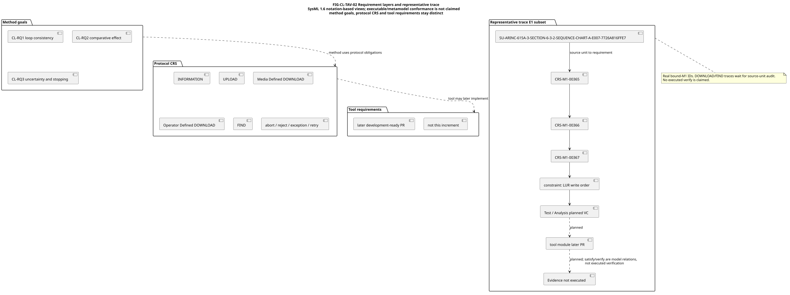
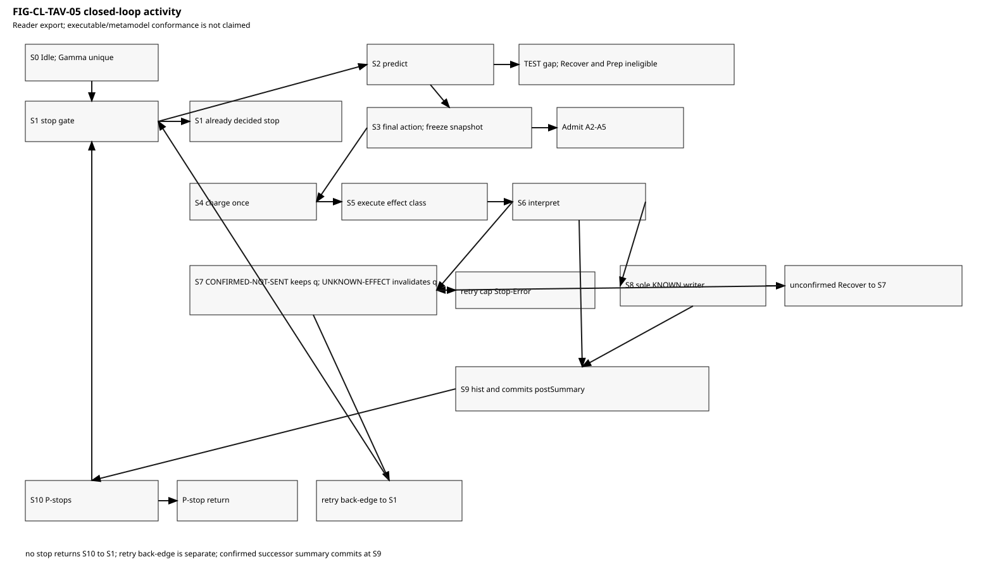
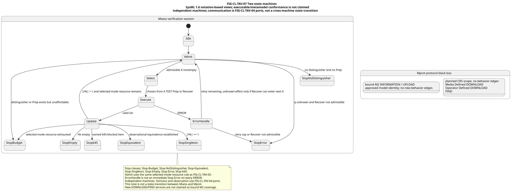

# CL-TAV Research Plan

Reader entry for CR-2026-013 and the CR-2026-015 TAES first draft. Authoritative files remain the method report, DD-028–034, DD-037, `RESEARCH_OUTLINE.md`, SysML sources, ALG-CLTAV-01, and the protocol source-audit ledger. The journal draft lives in [`../../../docs/research/publication/drafts/taes-cltav/`](../../../docs/research/publication/drafts/taes-cltav/). This page does not copy the CRS database.

## Method change summary

Successor method: Closed-Loop Test–Analysis Verification (CL-TAV). First-version direction accepted 2026-09-14 in DD-029. Combination of Test and Analysis is not a first-invention claim. Finite termination uses uniform \(c_{\min}>0\) plus finite \(B\), or finite \(K_{\max}\); `ERROR` spends the same resource.

## Thesis outline

Eight chapters map to TAES sections I–VIII. Each chapter in `docs/research/publication/RESEARCH_OUTLINE.md` states claim, CL-RQ, algorithm or architecture, required experiment, figures, what exists, and the gap. Chapter 6 / Section VI reserves result layout; no unrun results. The first-draft PDFs, when built, are `CLTAV_TAES_DRAFT.pdf` and `CLTAV_TAES_SUPPLEMENT.pdf`.

## System-engineering views

SysML 1.6 notation-based PlantUML sources: [`../../../docs/research/publication/models/`](../../../docs/research/publication/models/). Executable or complete metamodel conformance is not claimed. Two machines remain independent; communication is FIG-CL-TAV-04 ports, not a cross-machine state transition. Bound M2 is INFORMATION/UPLOAD only.

| ID | Caption | Reader figure |
|---|---|---|
| FIG-CL-TAV-01 | Context: IUT, adapter, 645 boundary | [svg](figures/FIG-CL-TAV-01-context.svg) |
| FIG-CL-TAV-02 | Requirement layers and CRS-M1-00365 trace | [svg](figures/FIG-CL-TAV-02-requirement-layers.svg) |
| FIG-CL-TAV-03 | BDD blocks | [svg](figures/FIG-CL-TAV-03-bdd.svg) |
| FIG-CL-TAV-04 | IBD ports | [svg](figures/FIG-CL-TAV-04-ibd.svg) |
| FIG-CL-TAV-05 | Closed-loop activity; predict before select; exclusive TEST/Prep/Recover | [svg](figures/FIG-CL-TAV-05-closed-loop-activity.svg) |
| FIG-CL-TAV-06 | Diagnostic sequence; Prep over uninformative; second Izk to Analysis | [svg](figures/FIG-CL-TAV-06-diagnostic-sequence.svg) |
| FIG-CL-TAV-07 | Two machines; Admit A1-A5; exclusive P1–P5 stops | [svg](figures/FIG-CL-TAV-07-two-state-machines.svg) |
| FIG-CL-TAV-08 | Parametric constraints, not a solved network | [svg](figures/FIG-CL-TAV-08-parametric.svg) |
| FIG-CL-TAV-09 | Experiment architecture; evaluator-only truth | [svg](figures/FIG-CL-TAV-09-experiment-architecture.svg) |

## Experiment design

Four arms CL-T, CL-A, CL-TA, CL-LOOP; detection, localization and ablation families in `docs/research/EXPERIMENT_PLAN.md`. Top-level algorithm source: [`../../../docs/research/publication/algorithms/ALG-CLTAV-01.tex`](../../../docs/research/publication/algorithms/ALG-CLTAV-01.tex). Typeset reader PDF: [`ALG-CLTAV-01.pdf`](ALG-CLTAV-01.pdf). Register before confirmatory runs. No Configuration and no live load in this increment. No filled result numbers here.

## Expanded CRS index and audit

Current bound package is M1-CANDIDATE-25: 3152 coverage units and 862 requirements, including 664-7 max_jitter equations with VL summation, 150 us technological latency, MAC source construction, 664P4-1 address-rule leaves for the first CRS-M1-00519 alternative, and 615A-triggered 645 semantic leaves. The integrator-identified address path remains open; this does not select Part 4 or activate AFDX. FIND abort does not waive the 2 s / 3 s clocks. Commentary and examples stay non-normative. instanceBoundOperations stay UPLOAD/INFORMATION; researchExpandedOperations are DOWNLOAD/FIND. Bound M2 does not execute FIND, DOWNLOAD or AFDX; FIND timing is observational catalog only. Media Defined and Operator Defined DOWNLOAD stay separate. AFDX stays a conditional deployment and does not activate the current Compliant instance. 665 §2.3 is not leaf-CRS-closed. ARINC 645-1 2021 is SOURCE/SEMANTIC bound; four integrity capabilities stay NOT-ESTABLISHED. Ledger: `configs/research/cltav_protocol_source_audit.json`. Do not batch-rename remaining deferred labels. Tool software requirements are out of this PR.

## Historical versus successor evidence

The freeze-commit 94-block math check proves only that historical objects were not rewritten. It does not prove successor mathematics. `independentMathematicalApproval` and `independentReviewApproval` remain false.

# 中文版

CR-2026-013 与 CR-2026-015 TAES 初稿的读者入口。权威文件仍是方法报告、DD-028～034、DD-037、`RESEARCH_OUTLINE.md`、SysML 源、ALG-CLTAV-01 和协议来源审计清单。期刊初稿位于 [`../../../docs/research/publication/drafts/taes-cltav/`](../../../docs/research/publication/drafts/taes-cltav/)。本页不另抄 CRS 数据库。

## 方法变更摘要

后继方法：闭环测试—分析协同验证方法（CL-TAV）。首版方向于 2026-09-14 在 DD-029 接受。Test 与 Analysis 的组合不是首次发明主张。有限终止采用统一 \(c_{\min}>0\) 加有限 \(B\)，或有限 \(K_{\max}\)；`ERROR` 消耗同一资源。

## 论文大纲

八章对应 TAES 第 I–VIII 节。`docs/research/publication/RESEARCH_OUTLINE.md` 中每章写明论点、CL-RQ、算法或架构、所需实验、图、已有材料和缺口。第6章／第 VI 节只保留结果版面，不填未跑结果。编译后的初稿 PDF 为 `CLTAV_TAES_DRAFT.pdf` 与 `CLTAV_TAES_SUPPLEMENT.pdf`。

## 系统工程视图

SysML 1.6 记法 PlantUML 源：[`../../../docs/research/publication/models/`](../../../docs/research/publication/models/)。不声称可执行或完整元模型符合性。两套机器保持独立；通信是 FIG-CL-TAV-04 端口，不是跨机状态迁移。已绑定 M2 只覆盖 INFORMATION／UPLOAD。

| ID | 图注 | 读者图 |
|---|---|---|
| FIG-CL-TAV-01 | 上下文：IUT、适配器、645 边界 | [svg](figures/FIG-CL-TAV-01-context.svg) |
| FIG-CL-TAV-02 | 需求层次与 CRS-M1-00365 追踪 | [svg](figures/FIG-CL-TAV-02-requirement-layers.svg) |
| FIG-CL-TAV-03 | BDD 分块 | [svg](figures/FIG-CL-TAV-03-bdd.svg) |
| FIG-CL-TAV-04 | IBD 端口 | [svg](figures/FIG-CL-TAV-04-ibd.svg) |
| FIG-CL-TAV-05 | 闭环活动；选择前预测；互斥 TEST／Prep／Recover | [svg](figures/FIG-CL-TAV-05-closed-loop-activity.svg) |
| FIG-CL-TAV-06 | 诊断序列；Prep 优先于无信息测试；第二次 Izk 进入 Analysis | [svg](figures/FIG-CL-TAV-06-diagnostic-sequence.svg) |
| FIG-CL-TAV-07 | 两套机器；Admit A1-A5；互斥 P1–P5 停止 | [svg](figures/FIG-CL-TAV-07-two-state-machines.svg) |
| FIG-CL-TAV-08 | 参数约束，不是已求解网络 | [svg](figures/FIG-CL-TAV-08-parametric.svg) |
| FIG-CL-TAV-09 | 实验架构；评价器真值 | [svg](figures/FIG-CL-TAV-09-experiment-architecture.svg) |

## 实验设计

四臂 CL-T、CL-A、CL-TA、CL-LOOP；检测、定位、消融。总体算法源：[`../../../docs/research/publication/algorithms/ALG-CLTAV-01.tex`](../../../docs/research/publication/algorithms/ALG-CLTAV-01.tex)。排版读者 PDF：[`ALG-CLTAV-01.pdf`](ALG-CLTAV-01.pdf)。确认性运行前登记。本增量无 Configuration、无实网加载。此处不填结果数字。

## 扩大 CRS 索引与审计

当前绑定包为 M1-CANDIDATE-25：3152 条 coverage、862 条需求，含带 VL 求和的 664-7 max_jitter 公式、150 微秒技术时延、MAC 源地址构造、CRS-M1-00519 第一条替代路径的 664P4-1 地址规则叶，以及 615A 触发的 645 语义叶。集成商指明的地址路径仍开放；这不选定第 4 部分，也不激活 AFDX。FIND 中止不豁免 2 秒／3 秒时钟。评注与示例保持非规范。instanceBoundOperations 仍为 UPLOAD／INFORMATION；researchExpandedOperations 为 DOWNLOAD／FIND。绑定 M2 不执行 FIND、DOWNLOAD 或 AFDX；FIND 时序只进入观察目录。Media Defined 与 Operator Defined DOWNLOAD 保持分开。AFDX 仍为条件化部署，不激活当前 Compliant 实例。665 §2.3 不是叶级 CRS 已闭合。ARINC 645-1 2021 来源／语义已绑定；四项完整性能力仍为 NOT-ESTABLISHED。清单：`configs/research/cltav_protocol_source_audit.json`。不得批量改名仍延期的标签。工具软件需求不属于本 PR。

## 历史与后继证据

冻结提交上 94 块数学核验只证明历史对象未被改写，不证明后继数学正确。`independentMathematicalApproval` 与 `independentReviewApproval` 保持 false。
